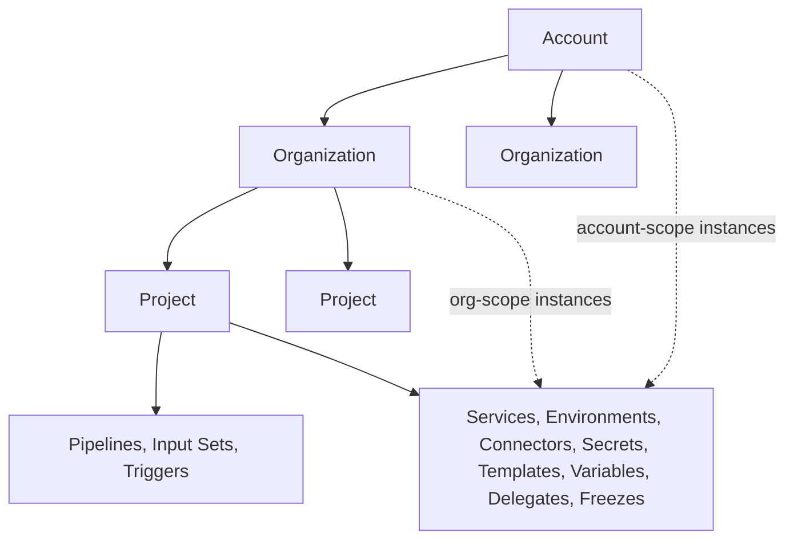

# Chapter 1. The resource model

Everything in Harness is a *resource with an address*. Before you learn any
individual entity — Pipeline, Service, Connector — learn the four rules that
apply to all of them: where a resource lives (scope), how it is named
(identifier vs. name), how it is represented (YAML), and how it is stored
(inline vs. Git). Once those rules are internalized, every new entity you
meet is just "another resource that follows the rules."

## 1.1 Scope: Account > Organization > Project

Harness arranges everything under a three-level hierarchy:



- The **Account** is the root; every resource belongs to exactly one account.
  Nearly every API schema carries an `accountIdentifier`/`accountId` field
  (corpus/entity_schemas.md: `ConnectorInfoDTO`, `FreezeResponse`).
- **Organizations** group projects, typically per business unit. The v1 API
  makes the containment literal in the URL:
  `/v1/orgs/{org}/projects/{project}/pipelines` (corpus/path_tree.txt).
- **Projects** are where day-to-day work happens.

Scope is a *first-class attribute* of most resources, not an afterthought.
Services, Environments, Connectors, Secrets, Templates, Variables, Delegates,
and Freeze windows can each be created at account, org, **or** project scope
(docs/continuous-delivery/x-platform-cd-features/services/services-overview.md;
docs/continuous-delivery/x-platform-cd-features/environments/environment-overview.md;
docs/platform/templates/template.md;
docs/platform/variables-and-expressions/add-a-variable.md;
docs/platform/delegates/delegate-concepts/delegate-overview.md;
docs/continuous-delivery/manage-deployments/deployment-freeze.md).
Creating a resource higher in the hierarchy shares it downward: "Account, org,
and project variables are available to all lower scopes"
(add-a-variable.md).

Three entities are the exception: **Pipelines, Input Sets, and Triggers exist
only at project scope**. Both API generations agree — there are no
account/org-level pipeline endpoints anywhere in the 474-path spec
(INFERRED from corpus/path_tree.txt).

### Cross-scope references: the `org.` / `account.` prefixes

When a project-scope resource points at a higher-scope resource, the
reference carries a prefix. The environment-group doc states the rule
explicitly (docs/continuous-delivery/x-platform-cd-features/environments/create-environment-groups.md):

```yaml
envIdentifiers:
  - test                              # project scope: no prefix
  - org.testE                         # org scope: "org." prefix
  - account.CDCNGAuto_EnvNg59wFkWCjQQ # account scope: "account." prefix
```

The same syntax appears wherever references appear: connectors
(`connectorRef: account.Harness_DockerHub`, `connectorRef: org.bitnami` —
services-overview.md), secrets, templates, and variables (which use their own
expression forms: `<+variable.account.NAME>`, `<+variable.org.NAME>` —
add-a-variable.md).

**Why it matters:** identifiers are unique *within a scope*, so `nginx` at
project scope and `nginx` at account scope are different resources. The
prefix is what disambiguates them (INFERRED from the reference design).

Visibility is one-directional: a project resource can reference upward
(project → org → account), never downward. Templates make this concrete: "You
cannot reference objects downwards in the hierarchy; however ... you can use
resources upwards" (docs/platform/templates/template.md).

## 1.2 Identifier vs. name

Every entity has two labels with different contracts:

| | Identifier (`identifier`) | Name (`name`) |
|---|---|---|
| Purpose | Machine address; used in URLs, references, expressions | Human display label |
| Mutability | **Immutable once saved** | Mutable any time |
| Canonical regex | `^[a-zA-Z_][0-9a-zA-Z_$]{0,127}$` | `^[a-zA-Z_][0-9a-zA-Z-_ ]{0,127}$` |
| Uniqueness | Within its scope container | Not enforced as identity |

Regexes quoted from corpus/entity_schemas.md (`PipelineCreateRequestBody`);
the mutability rule from docs/platform/pipelines/add-a-stage.md: "once the
stage is saved, the **Id** becomes immutable. You can change the **Name** at
any time, but you can't change the **Id**."

Watch for per-entity deviations — they are small but real:

- **Secret** identifiers additionally allow hyphens:
  `^[a-zA-Z_][0-9a-zA-Z_$-]{0,127}$` (entity_schemas.md: Secret).
- **Environment Group** identifiers do *not* allow `$`:
  `^[a-zA-Z_][0-9a-zA-Z_]{0,127}$` (entity_schemas.md: EnvironmentGroupRequest).
- **Connector** names drop the leading-letter requirement:
  `^[0-9a-zA-Z-_ ]{0,127}$` (entity_schemas.md: Connector).

(Collected as a gotcha list in Appendix D#6.)

## 1.3 YAML is the native representation

"Everything you can do in the Visual editor, you can also represent in YAML"
(docs/platform/pipelines/harness-yaml-quickstart.md). Pipelines, connectors,
triggers, input sets, services, environments, freezes — each has a YAML form
whose top-level key names the entity type (`pipeline:`, `connector:`,
`trigger:`, `inputSet:`, `service:`, `environment:`, `freeze:` — see the
examples throughout corpus/yaml_examples/). The create APIs take the YAML as
a string field: `pipeline_yaml`, `input_set_yaml`, `template_yaml`
(entity_schemas.md: PipelineCreateRequestBody, InputSetCreateRequestBody,
TemplateCreateRequestBody).

Three value forms can appear in most YAML fields
(docs/platform/variables-and-expressions/runtime-inputs.md):

1. **Fixed values** — literal, decided at design time.
2. **Runtime input** — the placeholder `<+input>`, to be supplied when the
   pipeline runs (Chapter 3).
3. **Expressions** — `<+...>` references resolved during execution, e.g.
   `<+secrets.getValue("somesecret")>` or `<+stage.variables.NAME>`.

This is the single most important YAML fact in Harness: *any* of the three
can go almost anywhere, which is what makes one pipeline reusable across
many scenarios.

## 1.4 Inline vs. Git-backed storage (GitX)

Each pipeline (and input set, and template) is stored either inside Harness
or in your Git repo. The spec exposes this as `storeType`: enum
`INLINE, REMOTE, INLINE_HC`, with `gitDetails` and `connectorRef` alongside
(entity_schemas.md: PipelineExecutionSummary; TemplateResponse has the same
pair). The API surface has dedicated verbs for the Git lifecycle: import
(`/v1/.../pipelines/{pipeline}/import`), Git metadata
(`.../git-metadata`), and inline↔remote moves (`.../move-config`)
(corpus/path_tree.txt).

The mental model: **Git is a storage backend chosen per entity, not a
different kind of entity.** A "remote" pipeline behaves like any other
pipeline; Harness fetches its YAML from the configured repo/branch through a
connector. Input sets can be imported from Git the same way
(docs/platform/pipelines/input-sets.md, "Import input sets"), and triggers
can even pin which branch or tag the pipeline YAML is loaded from at
execution time (`pipelineBranchName`, docs/platform/triggers/triggering-pipelines.md).

> **Note.** The dedicated Git Experience docs subtree is not part of this
> corpus; storage claims above rest on the spec fields and the pipeline/
> input-set/trigger docs cited. Logged in Appendix D#5.

## 1.5 Two API generations, one domain

Harness currently exposes the same entities through two REST surfaces:

| | v1 beta | legacy NextGen (NG) |
|---|---|---|
| Shape | Resource-oriented, scope in the path | RPC-ish, scope in query params |
| Example | `/v1/orgs/{org}/projects/{project}/pipelines/{pipeline}` | `/pipeline/api/pipelines/{pipelineIdentifier}?accountIdentifier=...&orgIdentifier=...&projectIdentifier=...` |
| Naming | kebab-case (`input-sets`) | camelCase (`inputSets`) |
| Coverage in corpus | Pipelines, input sets, executions, services, environments+infra, connectors, secrets, approvals, gitx-webhooks | Everything, incl. triggers, templates, freeze, delegates, overrides, env groups |

(paths from corpus/path_tree.txt)

Treat these as **two views of one object, never two objects**. A pipeline
created via `/v1/...` is listed by `/pipeline/api/pipelines`; the entity is
the same row in the same domain. This book models each entity once and gives
both API surfaces in its Appendix A table. Where one generation lacks an
endpoint (e.g. no v1 trigger CRUD in this corpus), that's an API-coverage
gap, not a missing entity (Appendix D#9).

URL nesting in the v1 generation doubles as **ownership evidence**:
`/v1/environments/{environment}/infrastructures/{infrastructure-definition}`
tells you an Infrastructure Definition belongs to an Environment
(corpus/path_tree.txt) — a fact the docs confirm
(environment-overview.md). Appendix B uses this technique for every edge.

## 1.6 The map of adjacent modules (not covered)

Pipelines are one Harness module family. You will see these named in menus,
docs, and even in this corpus's spec (keyword over-inclusion); they are
**out of scope for this book**: GitOps, RBAC internals, Cloud Cost Management
(CCM), Feature Flags, Security Testing Orchestration (STO), Chaos
Engineering, Internal Developer Portal (IDP), Software Engineering Insights
(SEI), Code Repository, Artifact Registry internals, and Database DevOps.
Two of them still touch your pipelines at the edges: Feature Flag and
Security Tests exist as *stage types* (docs/platform/pipelines/add-a-stage.md),
and Harness Code can serve as a pipeline's codebase
(docs/continuous-integration/use-ci/codebase-configuration/create-and-configure-a-codebase.md).

## Walkthrough: reading one YAML with the four rules

The account-level service from
docs/continuous-delivery/x-platform-cd-features/services/services-overview.md:

```yaml
service:
  name: nginx                # rule 2: mutable display name
  identifier: nginx          # rule 2: immutable address, unique per scope
  serviceDefinition:
    type: Kubernetes
    spec:
      manifests:
        - manifest:
            identifier: nginx-base
            type: K8sManifest
            spec:
              store:
                type: Github
                spec:
                  connectorRef: account.Harness_K8sManifest  # rule 1: account-scope reference
                  repoName: <+input>                         # rule 3: runtime input
                  branch: main                               # rule 3: fixed value
      artifacts:
        primary:
          primaryArtifactRef: <+input>
          sources:
            - identifier: harness dockerhub
              type: DockerRegistry
              spec:
                connectorRef: account.Harness_DockerHub      # rule 1 again
                tag: <+input>
```

Note what's *absent*: no `orgIdentifier`/`projectIdentifier` fields — this
service lives at account scope, and scope is expressed by omission of the
lower-scope fields (the API doc confirms: "if you create an environment at an
account level, you will not need org or project identifiers in the post API
call payload", environment-overview.md).

> ### Mental model
>
> Harness is a tree of scopes — Account > Org > Project — and every resource
> is a YAML document pinned to one node of that tree, addressed by an
> immutable identifier that is unique at that node. References climb the tree
> upward using `org.` / `account.` prefixes and never point down. Two API
> generations read and write the same documents; Git can hold the document
> text, but the entity always lives in Harness.

### Check your understanding

1. Your project pipeline references `connectorRef: docker_hub` and it works;
   a colleague's pipeline in another project of the same org gets "connector
   not found" with the same line. What are the two most likely explanations?
   *(§1.1: the connector is project-scoped to your project; or theirs should
   reference `org.docker_hub`/`account.docker_hub`.)*
2. Why can you rename a pipeline freely but not change its identifier, and
   what would break if you could? *(§1.2: identifiers are the address used by
   triggers' `pipelineIdentifier`, input sets, URLs, expressions.)*
3. A teammate says "our pipelines are in GitHub, so Harness doesn't have
   them." What's wrong with that statement? *(§1.4: REMOTE is a storeType;
   the entity, its identifier, executions, and triggers live in Harness.)*
4. You find `/pipeline/api/pipelines` and `/v1/orgs/{org}/projects/{project}/pipelines`
   in the API spec. How many pipeline entities does this imply? *(§1.5: one —
   two generations, one domain.)*
