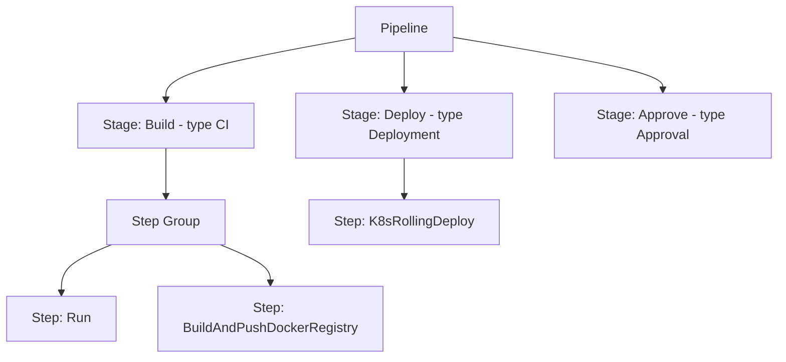

# Chapter 2. The pipeline aggregate

A Harness pipeline is not a flat list of jobs. It is an *aggregate* — one
YAML document with a strict containment hierarchy:



The pipeline owns its stages; each stage owns its steps (optionally grouped);
nothing at a lower level exists independently. Understanding this one
containment chain — and what each level contributes — is most of what
"knowing Harness pipelines" means.

## 2.1 Pipeline: the aggregate root

"Harness pipeline YAML lets you model your release process declaratively.
Each pipeline entity, component, and setting has a YAML entry"
(docs/platform/pipelines/harness-yaml-quickstart.md). The root document shape
(same doc, "Basic pipeline structure"):

```yaml
pipeline:
  name: YAML Example          # display name
  identifier: YAML_Example    # immutable address (Ch 1)
  projectIdentifier: default  # pipelines are project-scoped, always
  orgIdentifier: default
  tags: {}
  description:
  stages:                     # the owned children
    - stage: ...
    - stage: ...
  notificationRules:
  flowControl:
  properties:                 # pipeline-wide properties, e.g. CI codebase
  timeout:
  variables:                  # pipeline variables (Ch 3)
    -
```

Beyond stages, the root level carries pipeline-wide concerns: variables,
notification rules, flow control (barriers), the CI codebase
(`properties.ci.codebase` — Chapter 6), and a timeout. A minimum
configuration is required before a pipeline can even be saved
(harness-yaml-quickstart.md).

## 2.2 Stage: typed unit of work

"A stage is a part of a pipeline that contains the logic to perform a major
segment of a larger workflow... Stages are often based on the different
workflow milestones, such as building, approving, and delivering"
(docs/platform/pipelines/add-a-stage.md).

The **stage type** is the pivotal design decision — it determines the
available settings, the step catalog, and which module's semantics apply.
The catalog (add-a-stage.md):

| Type | Purpose |
|---|---|
| **Build** (`type: CI`) | Build, test, push artifacts (Chapter 6) |
| **Deploy** (`type: Deployment`) | Deploy services to environments (Chapter 7) |
| **Approval** | Human/ticket gates between stages (Chapter 5) |
| **Custom** | Anything else — no predefined requirements |
| **Pipeline** | Run another pipeline as a chained stage |
| **Feature Flag**, **Security Tests** | Adjacent modules' stage types (Ch 1.6) |
| **Dynamic** | Stage whose YAML is supplied/generated at runtime |

The generic stage skeleton (harness-yaml-quickstart.md, "Basic stage
structure"):

```yaml
- stage:
    identifier: mystage      # immutable once saved (add-a-stage.md)
    name: my stage
    type: Deployment         # determines everything below
    spec:
      serviceConfig: ...     # CD stages: what to deploy
      infrastructure: ...    # where to run / deploy
      execution:
        steps: [...]         # the owned steps
    variables: [...]         # stage variables
    when:                    # conditional execution
      pipelineStatus: ...
    failureStrategies: [...]
```

The `stage.spec` sections correspond one-to-one with the tabs you see in the
visual Pipeline Studio (harness-yaml-quickstart.md, "Stage spec") — a useful
Rosetta stone when a colleague talks in UI terms and you're reading YAML.

Stages also carry the *execution-control* settings — conditional execution
(`when`), failure strategies, and looping strategies (matrix / repeat /
parallelism) live on the stage's Advanced tab (add-a-stage.md) and are
covered in Chapter 5.

### Stage variables travel forward

Stage variables are defined on one stage but "available across the pipeline
and you can override their values in later stages" (add-a-stage.md). Within
the defining stage: `<+stage.variables.NAME>`; from elsewhere:
`<+pipeline.stages.STAGE_ID.variables.NAME>`. This is the built-in mechanism
for passing configuration between stages.

## 2.3 Step and step group: the work itself

Steps are the atomic actions; their catalog is set by the stage type — a CI
stage offers Run / Build and Push / Background / Plugin / Test steps
(docs/continuous-integration/use-ci/prep-ci-pipeline-components.md, "Steps"),
a CD stage offers deployment steps, shell scripts, and approvals
(docs/continuous-delivery/x-platform-cd-features/cd-steps/...). A minimal
step (yaml_examples/platform__secrets__add-use-text-secrets.md.yaml):

```yaml
- step:
    type: Run
    name: Run_1
    identifier: Run_1
    spec:
      shell: Sh
      command: |
        echo $SECRET | base64 --decode > decoded.txt
      envVariables:
        SECRET: <+secrets.getValue("secretfile")>
```

**Step groups** bundle steps that share settings — shared paths, privileges,
or (in CD) a container environment
(docs/continuous-delivery/x-platform-cd-features/cd-steps/containerized-steps/containerized-step-groups.md):

```yaml
stepGroup:
  privileged: true
  name: k8s-step-group
  sharedPaths:
    - /var/run
    - /var/lib/docker
```

(yaml_examples/continuous-delivery__cd-infrastructure__aws-cdk__cdk-image-build.md.yaml, example 1)

Steps and step groups can run in `parallel:` blocks
(yaml_examples/continuous-delivery__cd-onboarding__new-user__cd-pipeline-modeling-overview.md.yaml),
and whole stages can run in parallel too
(docs/platform/pipelines/looping-strategies/run-stages-in-parallel.md).

## 2.4 What is an entity, what is not

A useful discipline when reading the YAML:

- **Pipeline** is an addressable entity: it has CRUD endpoints in both API
  generations (`/v1/orgs/{org}/projects/{project}/pipelines`,
  `/pipeline/api/pipelines` — corpus/path_tree.txt).
- **Stage, step, step group** are *not* independently addressable — no CRUD
  endpoints exist for them; they live and die with their pipeline document.
  Their independent-reuse story is Templates (Chapter 9), which wrap a stage
  or step definition in a versioned, scoped entity.
- The runtime counterparts — Execution and its node graph — are separate
  entities created per run (Chapter 5).

## Walkthrough: a production-grade pipeline skeleton

From the CD pipeline-modeling guide
(yaml_examples/continuous-delivery__cd-onboarding__new-user__cd-pipeline-modeling-overview.md.yaml,
example 1), abridged:

```yaml
pipeline:
  name: Golden Harness K8s Deployment
  identifier: Golden_Harness_K8s_Deployment
  projectIdentifier: Operations
  orgIdentifier: Harness
  tags: { golden: "", ops_owned: "", regulated: "" }
  stages:
    - stage:
        name: deploy_service
        identifier: deploy_service
        template:                       # stage BODY comes from a template (Ch 9)
          templateRef: Golden_K8s
          templateInputs:               # only the declared inputs appear here
            type: Deployment
            spec:
              services:
                values: <+input>        # runtime input (Ch 3)
              environments:
                values: <+input>
              execution:
                steps:
                  - stepGroup:          # step group inside the stage
                      identifier: pre_requisite
                      steps:
                        - step:
                            identifier: get_deployed_version
                            template: ...     # even steps can be templated
                  - step:
                      identifier: hpa
                      type: K8sApply
                      when:
                        condition: <+input>   # conditional execution
```

Read it with the aggregate in mind: one pipeline → one stage (whose *content*
is resolved from a template at a different scope) → step groups → steps. The
`<+input>` markers show where the aggregate is deliberately left open for
Chapter 3's parameterization machinery.

> ### Mental model
>
> A pipeline is a single YAML aggregate: Pipeline owns Stages, Stages own
> Steps (optionally via Step Groups). The stage *type* selects which module's
> semantics and step catalog apply, so a pipeline is really a sequence of
> typed segments — build here, approve there, deploy after. Only the pipeline
> is an addressable entity; everything inside it is document structure, and
> reuse of inner structure is what Templates are for.

### Check your understanding

1. Why is there no `DELETE /stages/{stage}` API? *(§2.4: stages aren't
   independently addressable; you edit the pipeline document.)*
2. You need the same hardening step sequence in 40 pipelines. Copying YAML
   works — what does the aggregate model suggest instead, and why? *(§2.4 /
   Ch 9: a step or step-group template — versioned, scoped, centrally fixed.)*
3. A stage needs a value computed in the previous stage. Which mechanism does
   the aggregate provide? *(§2.2: stage variables +
   `<+pipeline.stages.STAGE_ID.variables.NAME>`.)*
4. What determines whether a stage's `spec` contains `serviceConfig` and
   `infrastructure` versus `cloneCodebase` and `runtime`? *(§2.2: the stage
   type — Deployment vs CI.)*
