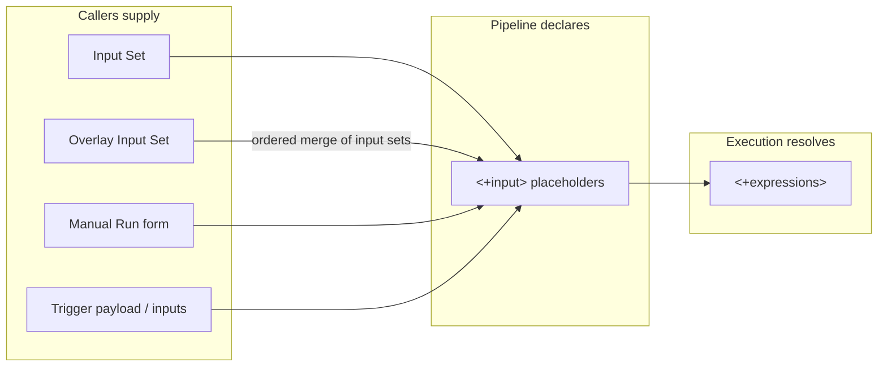

# Chapter 3. Parameterization: pipelines as functions

A pipeline you can only run one way is a script. Harness's parameterization
stack turns a pipeline into a *function*: the pipeline declares parameters
(runtime inputs), callers supply arguments (manually, via input sets, or via
triggers), and expressions compute derived values during the run.



## 3.1 Three value types, one selector

Most settings in a pipeline accept one of three value forms
(docs/platform/variables-and-expressions/runtime-inputs.md):

- **Fixed value** — decided at design time; never changes at runtime. Use for
  things that define the pipeline's identity, e.g. the codebase connector.
- **Runtime input** — the literal `<+input>`. "Runtime input provides a
  placeholder with the expectation that you'll define this value at runtime."
- **Expression** — `<+...>` resolved during execution from the pipeline's
  live context: `<+pipeline.variables.X>`, `<+stage.variables.Y>`,
  `<+secrets.getValue("z")>`, `<+service.name>`, trigger payload values, etc.

Runtime inputs can be refined with allowed values and defaults — e.g.
`<+input>.allowedValues(P0,P1,NA)`
(yaml_examples/continuous-delivery__cd-onboarding__new-user__cd-pipeline-modeling-overview.md.yaml)
and `<+input>.default("...")` (same file); more in
docs/platform/variables-and-expressions/runtime-input-usage.md.

"Almost any setting in a pipeline can use runtime input, including variables,
artifacts, connectors, environments, infrastructures, services, secrets, step
settings, looping strategies, and more"
(docs/platform/pipelines/input-sets.md).

## 3.2 Variables: named values at every level

Variables provide named, referenceable values at each level of the resource
tree (docs/platform/variables-and-expressions/add-a-variable.md):

| Defined at | Reference |
|---|---|
| Account | `<+variable.account.VAR_NAME>` |
| Org | `<+variable.org.VAR_NAME>` |
| Project | `<+variable.VAR_NAME>` |
| Pipeline | `<+pipeline.variables.VAR_NAME>` |
| Stage (same stage) | `<+stage.variables.VAR_NAME>` |
| Stage (from another stage) | `<+pipeline.stages.STAGE_ID.variables.VAR_NAME>` |

Higher-scope variables are visible to all lower scopes; service and
environment variables are available in stages that use those services and
environments (add-a-variable.md). Variable values can themselves be fixed,
runtime input, or expressions (docs/platform/pipelines/add-a-stage.md,
"Stage variables") — so a stage variable can be a *parameter* too.

The account/org/project Variable is a real entity with its own API
(`/ng/api/variables`, corpus/path_tree.txt) and — per the spec — only a
`String` type today (corpus/entity_schemas.md: VariableDTO `type` enum;
the docs' stage-variable YAML shows `String or Secret`, a doc/spec tension
logged in Appendix D#7).

Expressions can even reach *into fetched files*: a Kubernetes `values.yaml`
can contain `<+stage.variables.NAME>` and Harness substitutes it at runtime
(add-a-stage.md).

## 3.3 Input sets: saved arguments

"Input sets are collections of runtime input values for a pipeline"
(docs/platform/pipelines/input-sets.md). An input set:

- belongs to exactly one pipeline (`pipelineIdentifier` in its schema —
  corpus/entity_schemas.md: InputSetResponse);
- mirrors the pipeline's YAML shape, but contains **only** the fields whose
  pipeline value is `<+input>` — "If a setting doesn't use runtime input
  (`<+input>`), you can't define a value for it in an input set";
- doesn't have to be complete: leave some fields for manual input, or split
  values across several sets (input-sets.md).

Example (yaml_examples/platform__pipelines__harness-yaml-quickstart.md.yaml,
example 20):

```yaml
inputSet:
  name: My Input Set 1
  identifier: My_Input_Set
  orgIdentifier: default
  projectIdentifier: CD_Examples
  pipeline:                       # mirrors the target pipeline's shape
    identifier: YAML
    stages:
      - stage:
          identifier: Deploy
          type: Deployment
          spec:
            infrastructure:
              infrastructureDefinition:
                type: KubernetesDirect
                spec:
                  connectorRef: Kubernetes_Quickstart
                  namespace: default
```

You can mint an input set directly from a run: **Save as New Input Set** on
the Run form (input-sets.md) — the cheapest way to capture a known-good
argument list.

## 3.4 Overlay input sets: composition with a precedence rule

"Overlays are groups of input sets, which enable you to pull runtime inputs
from multiple input sets" (input-sets.md). The overlay stores an ordered
list of references:

```yaml
overlayInputSet:
  name: My Overlay Set
  identifier: My_Overlay_Set
  pipelineIdentifier: YAML
  inputSetReferences:    # resolved in order
    - My_Input_Set       # base
    - My_Input_Set_2     # wins on conflicts
```

(yaml_examples/platform__pipelines__harness-yaml-quickstart.md.yaml, example 22)

The precedence rule is *last writer wins*: "the setting's final value is the
value assigned in the last input set to be resolved"; later sets also fill
fields earlier sets left empty (input-sets.md, "Priority in overlays"). The
docs' canonical pattern: one "common defaults" set used by every run, plus
per-service sets, plus edge-case sets — composed per scenario
(input-sets.md, "Create overlays").

The legacy API exposes the merge as an operation:
`/pipeline/api/inputSets/merge`; v1 likewise
(`/v1/orgs/{org}/projects/{project}/input-sets/merge` — corpus/path_tree.txt).

## 3.5 Staleness: when the function signature changes

The pipeline's set of `<+input>` fields is effectively its *signature*.
Change it, and saved arguments drift:

- Input sets carry an `isOutdated` flag (corpus/entity_schemas.md:
  InputSetResponse).
- Triggers carry `isPipelineInputOutdated`
  (entity_schemas.md: NGTriggerDetailsResponseDTO), and: "Any time you change
  the settings that require runtime input in the pipeline, you must also
  update the pipeline inputs in the trigger. If the trigger doesn't have a
  value for a runtime input, then the pipeline can fail due to the missing
  value" (docs/platform/triggers/triggering-pipelines.md).

Treat a runtime-input change like an API signature change: update the saved
callers (input sets, overlays, trigger inputs) in the same breath.

## 3.6 A security note on runtime inputs

Runtime input values are supplied by whoever runs the pipeline: "runtime
input variables are accessible to anyone with permission to run the
pipeline", and passing secret expressions through runtime input can expose
secret values; the docs recommend OPA policies that block
`<+secrets.getValue` in runtime input
(docs/platform/variables-and-expressions/runtime-inputs.md, warning note).
Input sets themselves can be RBAC-controlled (View / Create-Edit / Delete
permissions; executing a pipeline with an input set requires View on the set
plus Execute on the pipeline) (input-sets.md, "Manage access to input sets").

## Walkthrough: one pipeline, three deployment scenarios

Take a deploy pipeline whose service, artifact tag, and target namespace are
all `<+input>`:

1. Create input set `common_defaults` — namespace conventions, default
   replica counts.
2. Create input sets `svc_payments`, `svc_checkout` — one per service, each
   naming its `serviceRef` and image path (compare example 20 above, which
   pins `connectorRef` and `namespace` per scenario).
3. Create overlay `payments_prod` = [`common_defaults`, `svc_payments`]. The
   per-service set resolves last, so its values win on any overlap
   (input-sets.md, "Priority in overlays").
4. Wire the overlay into a trigger (Chapter 4) or select it on the Run form.
   Remember the trigger constraint: input set *or* inline runtime values, not
   both; to tweak one field on top of a set, use the trigger's override-YAML
   approach (input-sets.md, "Using input sets with triggers").

> ### Mental model
>
> Think of a pipeline as a function. `<+input>` fields are its parameters;
> input sets are saved argument lists; an overlay is an ordered merge of
> argument lists where the last one wins; the Run form, and triggers, are the
> call sites. Expressions are the function's internal variables, resolved
> from live context during execution. And like any function, changing the
> signature (the set of `<+input>` fields) breaks saved callers — Harness
> marks them `isOutdated` rather than fixing them for you.

### Check your understanding

1. Why can't you put a value for a *fixed* pipeline setting into an input
   set? *(§3.3: input sets may only populate `<+input>` fields — the
   function only accepts declared parameters.)*
2. Two input sets in an overlay both set `namespace`. Which value applies?
   *(§3.4: the set listed later — last resolved wins.)*
3. After adding a new `<+input>` variable to a pipeline, nightly triggered
   runs start failing but manual runs work. Why? *(§3.5: the trigger's saved
   inputs no longer match the signature; manual runs prompt a human.)*
4. What's the difference between `<+input>` and `<+pipeline.variables.X>`?
   *(§3.1: a parameter supplied by the caller vs. an expression resolved from
   pipeline context at runtime.)*
