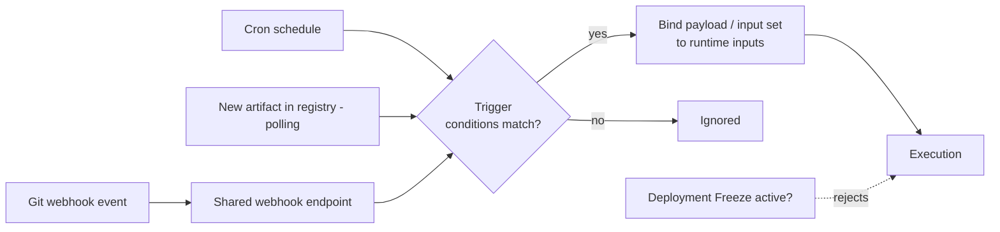

# Chapter 4. Triggers and events

Manual runs are the exception in a mature setup; most executions begin with
an *event*. The Trigger entity is Harness's event-to-execution adapter: it
listens for something happening (a Git push, a clock tick, a new artifact
version), decides whether that event matters (conditions), and starts a
pipeline with a specific set of runtime inputs (payload binding).



## 4.1 The trigger entity

A trigger is project-scoped, belongs to one pipeline
(`targetIdentifier` / `pipelineIdentifier`), and has a `type` from the enum
`Webhook, Artifact, Manifest, Scheduled, MultiRegionArtifact, SystemEvent`
(corpus/entity_schemas.md: NGTriggerResponse). Its YAML shape
(yaml_examples/platform__pipelines__harness-yaml-quickstart.md.yaml, example 18):

```yaml
trigger:
  name: ""
  identifier: ""
  enabled: true          # triggers can be switched off without deletion
  orgIdentifier: ""
  projectIdentifier: ""
  pipelineIdentifier: "" # the owning pipeline
  source:
    type: Webhook        # or Scheduled | Artifact | Manifest
    spec:
      type: Custom       # provider: Github, Gitlab, Bitbucket, Custom, ...
      spec:
        payloadConditions: []
        headerConditions: []
```

API surface: `/pipeline/api/triggers`, `.../triggers/{triggerIdentifier}`,
`.../triggers/{triggerIdentifier}/details`, plus a full event-history subtree
(`.../eventHistory/...`) for debugging what arrived and what matched
(corpus/path_tree.txt).

## 4.2 Webhook triggers: Git events

Webhook triggers "trigger pipelines in response to Git events that match
specific payload conditions... For example, when a pull request or push event
occurs" (docs/platform/triggers/triggering-pipelines.md). The moving parts:

1. **Connector.** Required for all Git providers except Custom and Harness
   Code; its token needs webhook-management permissions (for GitHub: repo
   admin + `repo`, `user`, `admin:repo_hook` scopes) (same doc).
2. **Event + actions.** e.g. GitHub `PullRequest, Push, IssueComment,
   Release` (corpus/entity_schemas.md: GithubWebhookTriggerSpec `type` enum).
3. **Webhook registration.** "For all Git providers supported by Harness,
   non-custom webhooks are automatically created in the repo"; Custom
   triggers (or failed auto-registration) mean copying the URL into the repo
   yourself (triggering-pipelines.md). Registration state is tracked:
   `registrationStatus` enum `SUCCESS, FAILED, ERROR, TIMEOUT, UNAVAILABLE`
   (entity_schemas.md: NGTriggerDetailsResponseDTO).

**The shared-URL warning deserves its own paragraph.** "All triggers in a
Harness account have the same URL:
`https://app.harness.io/gateway/ng/api/webhook?accountIdentifier=ACCOUNT_ID`"
(triggering-pipelines.md). Every event delivered there is evaluated against
your triggers' conditions — so conditions are not an optimization, they are
the only thing standing between "a push happened somewhere" and "my prod
pipeline ran."

### Conditions: AND-ed filters plus JEXL

Conditions can match source/target branches, changed files, headers, and
payload fields; "the **Conditions** are `AND`-ed together. To execute a
trigger, the event payload must match _all_ trigger conditions"
(triggering-pipelines.md). For `OR`/`NOT` logic, use a JEXL condition, e.g.

```
<+trigger.payload.pull_request.diff_url>.contains("triggerNgDemo")
  || <+trigger.payload.repository.owner.name> == "wings-software"
```

(same doc). Payload access syntax: `<+eventPayload.repository.full_name>` in
condition attributes, `<+trigger.payload...>` / `<+trigger.header['X-GitHub-Event']>`
in expressions. A mono-repo tip straight from the docs: condition on
**Changed Files** with a regex like `ci/.*` so only relevant directories
trigger runs.

## 4.3 Scheduled triggers: cron

Scheduled triggers use a cron source (spec type enum `Cron`,
corpus/entity_schemas.md: ScheduledTriggerSpec):

```yaml
source:
  type: Scheduled
  spec:
    type: Cron
    spec:
      expression: 0/5 * * * *
      type: UNIX
      timezone: America/New_York
```

(yaml_examples/platform__triggers__schedule-pipelines-using-cron-triggers.md.yaml)

Note the explicit `timezone` — schedule drift across regions is a classic
on-call surprise.

## 4.4 Artifact (and manifest) triggers: polling, not push

Artifact triggers "listen to the registry where one or more of the artifacts
in your pipeline are hosted"
(docs/platform/triggers/trigger-on-a-new-artifact.md). Unlike webhooks, these
are **polling-based**: a delegate polling job collects new tags/versions
(~one-minute interval) and fires the pipeline. Providers include Docker
Registry, ECR, GCR/GAR, ACR, Artifactory, Nexus3, S3, Jenkins, Bamboo, and
more (same doc).

The operational fine print (all from trigger-on-a-new-artifact.md):

- On creation, existing tags are collected but do **not** fire the pipeline —
  only genuinely new versions do.
- Default behavior: if several artifacts arrive in one polling window, one
  deployment runs with the **last** artifact; a default setting flips this to
  one execution per artifact (ordering not guaranteed).
- Never trigger on a floating tag like `latest` — metadata doesn't change, so
  nothing fires.
- Docker lists tags lexically; use lexically sortable version tags so "the
  image pushed last" is actually the one deployed.
- After creating/updating a trigger, the polling job takes 5–10 minutes to
  start.

## 4.5 Binding events to runtime inputs

A trigger completes the function-call picture from Chapter 3: it is a *call
site*. When configuring pipeline input for a trigger, "you can use either an
**input set** or provide **runtime values** directly, but not both at the
same time"; to override a few fields on top of an input set, use the
override-YAML approach (triggering-pipelines.md; also
docs/platform/pipelines/input-sets.md). Payload data flows into the run via
trigger expressions (`<+trigger.payload...>`), so a PR number or branch name
from the event can become the built branch, an image tag, or a variable.

For Git-stored pipelines, the trigger can even choose *which version of the
pipeline itself* to run: `pipelineBranchName` / `inputSetBranchName`, with
`$tag:v1.0.0` syntax for tag-based release flows (triggering-pipelines.md).

Keep the trigger's inputs in sync with the pipeline's signature: a missing
runtime input value fails the run, and the API flags drift via
`isPipelineInputOutdated` (Chapter 3.5;
entity_schemas.md: NGTriggerDetailsResponseDTO).

## 4.6 Interactions to remember

- **Freeze.** "When a freeze is running, triggers will not execute frozen
  pipelines. The trigger invocations are rejected" — except custom webhook
  triggers whose API key carries the freeze-override permission
  (docs/continuous-delivery/manage-deployments/deployment-freeze.md).
- **Codebase.** A webhook trigger needs the pipeline to have a default
  codebase to listen on (triggering-pipelines.md; Chapter 6.2).
- **Test Intelligence.** TI's call-graph hygiene depends on the trigger
  subscribing to Synchronize + merge/close events
  (docs/continuous-integration/use-ci/run-tests/ti-overview.md).
- **RBAC boundary.** Harness RBAC governs who manages triggers *in Harness*;
  who can cause the underlying Git/registry events is your provider's RBAC
  problem (triggering-pipelines.md).

## Walkthrough: from PR event to execution

A GitHub PR trigger on a mono-repo, assembled from the pieces above
(docs/platform/triggers/triggering-pipelines.md):

1. **Create** a GitHub-type trigger on the pipeline; payload type is set by
   the provider choice; select the code-repo connector.
2. **Event**: Pull Request, actions Open/Synchronize.
3. **Conditions**: Target Branch equals `main`; Changed Files regex
   `payments/.*` (only this service's directory fires it).
4. **Pipeline input**: select overlay `payments_ci` (Chapter 3 walkthrough);
   the built ref comes from the event via the codebase (`build: <+input>`
   receives the PR's branch/commit context).
5. **Save** — Harness auto-registers the webhook in the repo; verify
   registration status on the trigger.
6. A PR touching `payments/` opens → the shared endpoint receives the event →
   conditions all match → an Execution starts, its `executionTriggerInfo`
   recording the trigger as initiator (corpus/entity_schemas.md:
   PipelineExecutionSummary).

> ### Mental model
>
> A trigger is a standing subscription plus a call site. Webhook triggers
> subscribe to pushes at one shared account URL and rely entirely on
> AND-ed conditions to pick their events; scheduled triggers subscribe to the
> clock; artifact triggers *poll* registries and fire on genuinely new
> versions only. Whatever the source, the endgame is identical: bind an
> input set (or inline values, or payload expressions) to the pipeline's
> runtime inputs and start an execution — unless a freeze window says no.

### Check your understanding

1. Two unrelated pipelines in the same account keep triggering on each
   other's pushes. What single fact about webhook triggers explains this,
   and what's the fix? *(§4.2: one shared URL per account; tighten repo/
   branch/payload conditions.)*
2. Why does a brand-new artifact trigger not deploy the 10 image tags that
   already exist in the registry? *(§4.4: initial collection is suppressed
   by design; only subsequent pushes fire.)*
3. Your team triggers on `latest`. What will happen and why? *(§4.4: nothing
   — the tag's metadata never changes, so no new version is detected.)*
4. A trigger must run only when a PR into `main` changes `infra/` files OR
   carries the label `deploy`. How do you express that? *(§4.2: OR logic
   needs a JEXL condition; built-in conditions are AND-ed.)*
