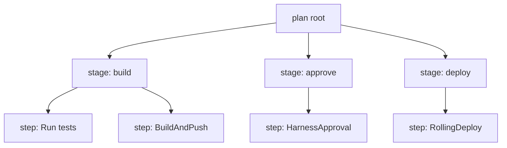

# Chapter 5. Execution

Chapters 2–4 described the *design-time* world: a pipeline document and its
callers. This chapter is about what exists after you press Run: the
**Execution** — a first-class entity with its own identifier, graph, status
machine, queue position, and control operations.

## 5.1 Execution as an entity

Each run creates an execution identified by a `planExecutionId`, with a
human-friendly `runSequence` counter and a summary record carrying the
pipeline identity, who/what triggered it (`executionTriggerInfo`), stage
counts, Git details for remote pipelines, and retry metadata
(corpus/entity_schemas.md: PipelineExecutionSummary). The legacy API serves
it at `/pipeline/api/pipelines/execution/v2/{planExecutionId}` with
summary/list endpoints alongside (corpus/path_tree.txt).

The name `planExecutionId` leaks a useful implementation truth: a run is the
execution of a *plan* compiled from your YAML — the pipeline document is
expanded (templates resolved, inputs merged, looping strategies unrolled)
into a node graph, then executed.

## 5.2 The execution graph

The runtime structure is an explicit graph: `ExecutionGraph` has a
`rootNodeId`, a `nodeMap`, and a `nodeAdjacencyListMap`
(corpus/entity_schemas.md: ExecutionGraph). The API can fetch the whole graph
(`.../execution/getExecutionGraph/{planExecutionId}`) or drill into one
node's subgraph (`.../subGraph/{planExecutionId}/{nodeExecutionId}`)
(path_tree.txt). Nodes correspond to the aggregate you wrote — pipeline →
stages → step groups → steps — plus the expansions (each matrix iteration is
its own node).



## 5.3 Statuses and transitions

The summary-level status enum, quoted verbatim
(corpus/entity_schemas.md: PipelineExecutionSummary):

`Running, AsyncWaiting, TaskWaiting, TimedWaiting, Failed, Errored,
IgnoreFailed, NotStarted, Expired, Aborted, Discontinuing, Queued`

Reading the family resemblances:

- **Waiting states** (`AsyncWaiting`, `TaskWaiting`, `TimedWaiting`) — the
  engine is parked on something: an async callback, a delegate task, a timer.
  Approvals and manual interventions park executions the same way (the UI
  shows **Paused** during manual intervention —
  docs/platform/pipelines/failure-handling/define-a-failure-strategy-on-stages-and-steps.md).
- **`Queued`** — admitted but not started (see 5.4).
- **`Discontinuing`** — the transient state of an abort in progress; abort is
  not instantaneous ("the pipeline finish executing the current task and then
  stops" — docs/platform/pipelines/failure-handling/abort-pipeline.md).
- **`Failed` vs `Errored`** — a failing user workload vs. the system unable
  to execute; **`IgnoreFailed`** — a failure converted to success by an
  Ignore failure strategy ("success (failure ignored)" in the UI, same
  failure-handling doc).
- **`Expired`** — a deadline passed (cf. approval `timeout: 1d` → approval
  status `EXPIRED`, corpus/entity_schemas.md: ApprovalInstanceResponse).

## 5.4 The queue

Executions don't necessarily start when created. "Executions sit in the
queue for three main reasons: the pipeline has resource constraints
configured, the maximum concurrent executions limit has been reached, or the
pipeline is waiting for another pipeline to release a lock it needs"
(docs/platform/pipelines/executions-and-logs/executions-management.md).
Queue positions are account-global; an Executions Management page (feature
flag `PIPE_QUEUED_PIPELINE_OBSERVABILITY`) lists and bulk-aborts queued runs
(`/pipeline/api/pipelines/queue-management/queued-pipelines`, `.../bulk-abort`
— path_tree.txt). Aborting a queued execution is permanent: "There is no way
to resume it" (same doc).

## 5.5 Interrupts: abort, mark-as-failed, manual intervention

- **Abort** stops after the current task; status becomes `Aborted`; Harness
  "**does not** clean up resources that were created during pipeline
  execution, such as pods" — the docs call abort a last resort precisely
  because end-of-pipeline cleanup is skipped
  (docs/platform/pipelines/failure-handling/abort-pipeline.md).
- **Mark as failed** is the cleanup-friendly alternative for stages: it
  fails the stage *through* the failure-strategy machinery, so rollback can
  run ("To clean up the workspace and revert back to the old state, mark the
  stage as failed" — abort-pipeline.md tip;
  docs/platform/pipelines/failure-handling/mark-as-failed.md).
- **Manual intervention** pauses at a failure and offers a human the choice:
  Mark as Success / Ignore Failure / Retry / Abort / Rollback Stage, with a
  timeout and post-timeout fallback action
  (define-a-failure-strategy-on-stages-and-steps.md).

## 5.6 Failure strategies: declarative failure handling

Stages, step groups, and steps each accept `failureStrategies` — rules
mapping error conditions to actions
(define-a-failure-strategy-on-stages-and-steps.md). The action catalog:
**Manual Intervention, Mark as Success, Ignore Failure, Retry Step / Retry
Step Group, Abort, Rollback Stage / Rollback Step Group, Mark As Failure**
(same doc, "Failure strategy actions" table). Retry takes a count, intervals,
and a post-retry-failure action:

```yaml
failureStrategies:
  - onFailure:
      errors: [AllErrors]
      action:
        type: Retry
        spec:
          retryCount: 2
          retryIntervals: [10s]
          onRetryFailure:
            action:
              type: StageRollback
```

(YAML shape from define-a-failure-strategy-on-stages-and-steps.md examples)

Note the asymmetry: there is a **Rollback Stage** action but "there is no
rollback step option" (same doc) — rollback semantics belong to the stage,
because only the stage knows what "the state prior to execution" means
(Chapter 7 covers CD rollback proper).

## 5.7 Retry vs. rerun

Two distinct after-the-fact operations, with distinct v1 endpoints
(corpus/path_tree.txt):

| | Endpoint | Meaning |
|---|---|---|
| **Retry** | `.../pipelines/{pipeline}/execute/retry/{execution-id}` | Resume a failed execution (from the failed point); gated by `canRetry` (`/pipeline/api/pipelines/execution/canRetry/{planExecutionId}`) |
| **Rerun** | `.../pipelines/{pipeline}/execute/rerun/{execution-id}` | A fresh execution using the previous run's inputs |

The summary object tracks the ancestry: `retryExecutionMetadata`,
`isRetriedExecution`, `canReExecute`, `showRetryHistory`
(entity_schemas.md: PipelineExecutionSummary). Selective-stage forms exist
for both (`.../execute/stages`, `.../execute/rerun/{execution-id}/stages`).

## 5.8 Approvals: executions that wait for humans

An Approval step (or stage) creates an **approval instance** attached to the
running execution: type enum `HarnessApproval, JiraApproval, CustomApproval,
ServiceNowApproval`; status enum `WAITING, APPROVED, REJECTED, FAILED,
ABORTED, EXPIRED` (corpus/entity_schemas.md: ApprovalInstanceResponse).
Harness Approval collects verdicts from user groups with a minimum count,
can bar the pipeline's own executor from approving
(`disallowPipelineExecutor`), and can collect **approver inputs** — values
the approver types that downstream steps read
(docs/continuous-delivery/x-platform-cd-features/cd-steps/approvals/using-harness-approval-steps-in-cd-stages.md;
YAML in Appendix A.13). Activity is queryable at
`/pipeline/api/approvals/{approvalInstanceId}/harness/activity`; v1 exposes
per-execution approvals at
`/v1/orgs/{org}/projects/{project}/approvals/execution/{execution-id}`
(path_tree.txt).

Approvals are the archetypal `TimedWaiting` execution: nothing is running,
a deadline is ticking (`timeout: 1d` → `EXPIRED`), and the graph resumes on
`APPROVE` or stops on `REJECT`.

## Walkthrough: reading a failed run like an operator

A deploy execution shows `Failed`. The investigation path the entities give
you:

1. **Summary** (`.../execution/summary` or the UI list): which stage failed
   (`failedStagesCount`, `layoutNodeMap`), what started the run
   (`executionTriggerInfo` — a trigger? a user?), is it a retry of something
   (`isRetriedExecution`)?
2. **Graph** (`getExecutionGraph/{planExecutionId}`): walk
   `nodeAdjacencyListMap` from `rootNodeId` to the failed node; fetch its
   `subGraph` for step-level detail.
3. **Decide the resume strategy**: `canRetry` true → retry resumes from the
   failed stage with the same inputs; otherwise rerun (fresh execution, same
   inputs) or a new run with corrected inputs (Chapter 3).
4. **If it's still running but doomed**: prefer *mark stage as failed* over
   abort so the failure strategy (e.g. `StageRollback`) executes and cleans
   up; abort leaves pods and half-deployed state behind
   (abort-pipeline.md).

> ### Mental model
>
> An execution is a compiled plan being walked: your YAML aggregate becomes a
> node graph, and each node moves through a small status machine. Most
> "weird" statuses are just different flavors of waiting — for a delegate
> task, a timer, a human approval, or a queue slot. Failure handling is
> declared, not improvised: failure strategies decide retry/ignore/rollback
> per node, manual intervention puts a human in the loop, and the
> retry-vs-rerun distinction is "resume this execution" vs. "new execution,
> same arguments." Abort is the emergency brake — immediate-ish, but it
> skips cleanup.

### Check your understanding

1. An execution has been `TaskWaiting` for 20 minutes. Which layer of the
   system is it waiting on, and which entity from Chapter 8 would you check?
   *(§5.3: a delegate task; check delegate connectivity/heartbeats.)*
2. Why does Harness distinguish `Aborted` from `Failed`, and why does the
   abort doc tell you to prefer mark-as-failed? *(§5.5: abort skips failure
   strategies and cleanup; mark-as-failed routes through rollback.)*
3. A run failed at stage 3 of 5 after a flaky infrastructure error. Retry or
   rerun, and why? *(§5.7: retry — resume from failure with identical
   inputs.)*
4. What happens to a Harness Approval step whose `timeout: 1d` elapses with
   only 1 of 2 required approvals? *(§5.8: instance status EXPIRED; the
   gate does not pass.)*
5. Which failure-strategy action would make a nonessential smoke-test step's
   failure invisible to the stage result, and what status does the docs' UI
   label show? *(§5.6/§5.3: Ignore Failure → "success (failure ignored)",
   IgnoreFailed.)*
