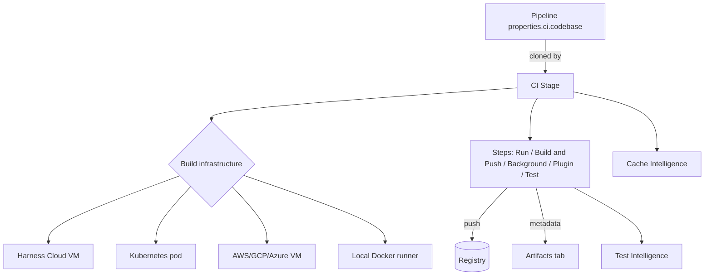

# Chapter 6. CI stages

A CI (Build) stage answers three questions: **where** do my steps run (build
infrastructure), **what code** do they run against (codebase), and **what
work** do they do (the CI step catalog). Around those, Harness layers two
"Intelligence" accelerators — test selection and dependency caching — and a
way to surface what the build produced (artifacts).



## 6.1 Build infrastructure: the where

The fundamental choice is Harness-managed versus self-managed
(docs/continuous-integration/use-ci/set-up-build-infrastructure/which-build-infrastructure-is-right-for-me.md):

| Option | Model | Notes |
|---|---|---|
| **Harness Cloud** | Each CI stage runs on a fresh, ephemeral Harness-managed VM; steps share the VM's filesystem; the VM terminates after the stage (docs/continuous-integration/use-ci/set-up-build-infrastructure/use-harness-cloud-build-infrastructure.md) | Linux/Windows/macOS; preinstalled toolchain; new features land here first; consumes build credits |
| **Kubernetes cluster** | "Each CI stage executes in a pod, and the stage's steps share the pod's resources" | Your cluster, reached via connector + delegate |
| **AWS/GCP/Azure VMs** | Self-managed VM fleets | More Docker freedom, native Windows; paid plans |
| **Local (Docker) runner** | Builds on a single machine | One-off / special-hardware builds |

Platform coverage: Linux amd64/arm64 everywhere; Windows amd64 everywhere
(arm64 nowhere); macOS arm64 effectively means Harness Cloud
(which-build-infrastructure-is-right-for-me.md, OS/arch matrix, including
the explicit recommendation to use Harness Cloud for macOS).

The choice is written per stage. Harness Cloud
(yaml_examples/continuous-integration__use-ci__caching-ci-data__cache-intelligence.md.yaml,
example 2):

```yaml
- stage:
    type: CI
    spec:
      platform:
        os: Linux
        arch: Amd64
      runtime:
        type: Cloud       # Harness Cloud
        spec: {}
```

Self-managed Kubernetes instead uses an `infrastructure` block of type
`KubernetesDirect` with a cluster `connectorRef` and namespace
(docs/continuous-integration/use-ci/set-up-build-infrastructure/k8s-build-infrastructure/set-up-a-kubernetes-cluster-build-infrastructure.md).

**Feature compatibility follows the infrastructure.** The docs' matrix is
worth memorizing in outline: Build Intelligence is Cloud/K8s + Linux only;
delegate selectors are "not applicable" on Harness Cloud and unsupported on
VM infra; Bitrise steps are Cloud-only; bring-your-own secret manager is
*not* supported on Harness Cloud
(which-build-infrastructure-is-right-for-me.md). When a CI feature
mysteriously doesn't work, check this matrix first.

## 6.2 Codebase: the what-against

"When you add a **Build** stage to a CI pipeline, you specify where your
build code is stored. This becomes the pipeline's _default codebase_"
(docs/continuous-integration/use-ci/codebase-configuration/create-and-configure-a-codebase.md).
The codebase lives on the *pipeline* (`properties.ci.codebase`), and each
Build stage clones it unless told otherwise:

```yaml
pipeline:
  ...
  properties:
    ci:
      codebase:
        connectorRef: YOUR_CODEBASE_CONNECTOR_ID
        build: <+input>          # branch / tag / PR picked at run or by trigger
```

(create-and-configure-a-codebase.md)

Per stage, `cloneCodebase: false` skips the automatic clone — for stages
that don't need source, or when you need custom clone behavior; pipelines can
also clone additional repos (same doc). Clone enhancements (Git LFS, sparse
checkout, submodules, custom clone path) are configurable on the codebase or
Git Clone step (same doc).

The codebase is also the anchor for *event context*: webhook triggers
require a default codebase to listen on
(docs/platform/triggers/triggering-pipelines.md), and the resolved clone is
described to your steps through built-in `<+codebase.*>` variables
(docs/continuous-integration/use-ci/codebase-configuration/built-in-cie-codebase-variables-reference.md).

## 6.3 The CI step catalog: the work

The Build stage's step families
(docs/continuous-integration/use-ci/prep-ci-pipeline-components.md, "Steps"):

- **Run** — scripts in a container (or on the host). The canonical CI step:

  ```yaml
  - step:
      type: Run
      name: Run pytest
      identifier: Run_pytest
      spec:
        connectorRef: YOUR_IMAGE_REGISTRY_CONNECTOR
        image: python:latest        # container image for the step
        shell: Sh
        command: |-
          pip install -r requirements.txt
          pytest -v --cov --junitxml="result.xml"
        reports:                     # surface JUnit results
          ...
  ```

  (docs/continuous-integration/use-ci/run-step-settings.md, pytest example)

- **Build and Push** — build an image and push to Docker Hub/ACR/ECR/GAR/
  JFrog etc.
  (docs/continuous-integration/use-ci/build-and-upload-artifacts/build-and-push/build-and-push-to-docker-registry.md).
- **Background** — long-lived stage services (databases, browsers,
  localstack) that steps can call
  (docs/continuous-integration/use-ci/manage-dependencies/background-step-settings.md).
- **Plugin** — Drone-style container plugins; also wrappers for GitHub
  Actions and Bitrise steps
  (docs/continuous-integration/use-ci/use-drone-plugins/plugin-step-settings-reference.md).
- **Test** — test execution wired into Test Intelligence (below).
- **Cache & data sharing steps** — SaveCache/RestoreCache to S3 or GCS
  (yaml_examples/continuous-integration__use-ci__caching-ci-data__save-cache-in-gcs.md.yaml).

Because a CI stage's steps share a filesystem (VM or pod), a `sharedPaths`
list on the stage extends what's visible across steps beyond `/harness`
(cache-intelligence.md YAML, example 2).

## 6.4 Test Intelligence: run less, know as much

"Harness Test Intelligence (TI) improves unit test time by running only the
unit tests required to confirm the quality of the code changes that triggered
the build" (docs/continuous-integration/use-ci/run-tests/ti-overview.md).
Selection inputs: changed code (from Git), changed tests, new tests; build
files like `pom.xml` trigger full runs. Architecture: a Harness-side TI
service holding call graphs and commit graphs, a Test Runner Agent on your
build infra, and the **Test** step that ties them together (same doc).

Constraints that matter in practice (all ti-overview.md):

- Unit tests only; languages: Python, Java, Ruby, C#, Kotlin, Scala
  (JS/Kotest in beta).
- Your Git triggers must include Synchronize and merge/close events, or TI's
  call graph goes stale.
- With test splitting (parallelism), each shard must write a unique JUnit
  file (`result_<+strategy.iteration>.xml`) and the report path must
  glob-match them all.
- Opt files out via `.ticonfig.yaml` in the repo.

## 6.5 Cache Intelligence: pay the dependency tax once

CI environments are ephemeral, so dependency downloads repeat on every run;
"Harness automatically caches and restores software dependencies to speed up
your builds"
(docs/continuous-integration/use-ci/caching-ci-data/cache-intelligence.md).
Enable per stage:

```yaml
- stage:
    type: CI
    spec:
      caching:
        enabled: true
        paths:
          - /harness/node_modules   # custom paths when needed
      cloneCodebase: true
```

(yaml_examples/continuous-integration__use-ci__caching-ci-data__cache-intelligence.md.yaml)

Auto-detection covers Maven, Gradle, Bazel, Yarn, Go, and .NET tools — but
only if the dependency file sits at the repo root or one level deep; deeper
monorepos need explicit `paths` (cache-intelligence.md). Storage: Harness-
managed on Harness Cloud (15-day retention, auto-eviction at the plan's
storage limit); bring your own object storage (S3/GCS/Azure Blob) on
self-managed infra (same doc).

## 6.6 Artifacts: what the build produced

Build-and-push steps publish images to registries through connectors; the
execution's **Artifacts tab** lists produced artifacts, and arbitrary files
can be surfaced there via the `artifact-metadata-publisher` plugin step
(docs/continuous-integration/use-ci/build-and-upload-artifacts/artifacts-tab.md;
YAML in Appendix A.20). The v1 API exposes per-execution artifacts:
`/v1/orgs/{org}/projects/{project}/pipelines/{pipeline}/executions/{execution}/artifacts`
(corpus/path_tree.txt).

Terminology guard: this build-output Artifact is different from a CD
service's *artifact source* (the registry coordinates of what you deploy —
Chapter 7) and from the Artifact Registry module (out of scope, Chapter 1.6).

## Walkthrough: anatomy of a real CI stage

Assembling the chapter into one annotated stage (structure per
cache-intelligence.md example 2 and run-step-settings.md):

```yaml
- stage:
    name: Build
    identifier: Build
    type: CI
    spec:
      cloneCodebase: true          # 6.2: clone the pipeline's default codebase
      caching:
        enabled: true              # 6.5: Cache Intelligence
      platform:
        os: Linux
        arch: Amd64
      runtime:
        type: Cloud                # 6.1: Harness Cloud ephemeral VM
        spec: {}
      execution:
        steps:
          - step:
              type: Run            # 6.3: unit tests (or type: Test for TI)
              identifier: test
              spec:
                image: python:latest
                shell: Sh
                command: pytest -v --junitxml="result.xml"
          - step:
              type: BuildAndPushDockerRegistry   # 6.3: produce the artifact
              identifier: push
              spec:
                connectorRef: account.docker_hub # Ch 1: account-scope connector
                repo: example/payments
                tags:
                  - <+pipeline.sequenceId>       # Ch 3: expression
```

Execution flow: the stage acquires a fresh VM → restores caches → clones the
codebase at the ref the trigger/event provided → runs tests (TI shrinking
the set if it's a Test step) → builds and pushes the image → saves caches →
reports the artifact — then the VM disappears
(use-harness-cloud-build-infrastructure.md).

> ### Mental model
>
> A CI stage is a short-lived machine with your repo checked out. Pick the
> machine (Harness Cloud VM, your K8s pod, your VMs, your laptop), and
> remember that steps in a stage share that machine's filesystem. The
> codebase is pipeline-level configuration that stages clone by default. The
> two Intelligences attack the two chronic time sinks — TI runs only tests
> the diff could affect; Cache Intelligence keeps dependencies across runs —
> and everything the build produces exits through connectors into
> registries, leaving a record on the Artifacts tab.

### Check your understanding

1. Why do CI steps in a stage see each other's files without any explicit
   sharing, and when do you need `sharedPaths` anyway? *(§6.1/6.3: one VM or
   pod per stage; sharedPaths for locations outside `/harness`.)*
2. Your macOS build must move off a flaky self-managed Anka farm. What does
   the corpus recommend and why? *(§6.1: Harness Cloud — macOS arm64 support
   plus licensing/complexity guidance.)*
3. TI suddenly selects *all* tests on a PR that touched one class plus
   `pom.xml`. Expected? *(§6.4: yes — build-file changes trigger full runs.)*
4. Cache Intelligence isn't caching your monorepo service at
   `services/api/pom.xml`. Why, and what's the fix? *(§6.5: detection only
   scans root + one level deep; set custom cache paths.)*
5. Where would a security-scan feature that "requires delegate selectors"
   be impossible to use? *(§6.1 matrix: Harness Cloud — selectors not
   applicable there.)*
