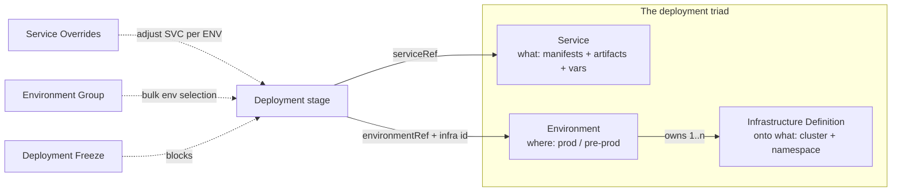

# Chapter 7. CD stages

A Deployment stage answers its own three questions with a triad of reusable
entities: **what** you deploy (Service), **where** you deploy it
(Environment), and **onto what exactly** (Infrastructure Definition). The
stage itself contributes the **how** — the execution strategy (rolling,
canary, blue-green), its mirror-image rollback, and the governance wrapped
around it (overrides, environment groups, freeze windows).



## 7.1 Service: what you deploy

"A Harness service represents what you're deploying." Its **Service
Definition** carries the deployment artifacts, manifests, config files, and
service variables
(docs/continuous-delivery/x-platform-cd-features/services/services-overview.md).
A service exists independently of pipelines — create it at account, org, or
project scope and reference it from as many pipelines as you like (same doc).

The two halves of a Kubernetes service definition (YAML in Appendix A.21,
from services-overview.md):

- **Manifests** — where the K8s manifests / Helm chart / values files live
  (a Git or Helm connector plus paths).
- **Artifacts** — the deployable image coordinates (a registry connector +
  `imagePath`), usually with `tag: <+input>` so each run picks a version.

Scope discipline applies with full force: an account-level service may only
reference account-level connectors — "these services are global and cannot
have dependencies at a lower hierarchy level" (services-overview.md).

## 7.2 Environment and Infrastructure Definition: where, precisely

"A Harness environment represents where you are deploying your application",
typed `PreProduction` or `Production` (docs/continuous-delivery/
x-platform-cd-features/environments/environment-overview.md; enum from
corpus/entity_schemas.md: EnvironmentRequest). An environment is a *logical*
target; the physical targets are its child **Infrastructure Definitions** —
"the specific VM, Kubernetes cluster, or target infrastructure", one or many
per environment ("within prod you have 5 infrastructure definitions
representing the 5 Kubernetes clusters", environment-overview.md).

Ownership is visible in both evidence planes: the API nests them
(`/v1/environments/{environment}/infrastructures/{infrastructure-definition}`,
corpus/path_tree.txt) and the YAML back-references the parent
(`environmentRef: dev` in the infra definition, environment-overview.md).
Infrastructure types span `KubernetesDirect, KubernetesGcp, KubernetesAzure,
Pdc, SshWinRmAzure, ServerlessAwsLambda, AzureWebApp, AzureFunction,
SshWinRmAws, CustomDeployment, ECS, Elastigroup`
(entity_schemas.md: InfrastructureRequest).

Environments also carry **environment variables** ("global variables for
that environment", environment-overview.md) usable in manifests and steps,
and `allowSimultaneousDeployments` on the infra definition gates concurrent
deploys into the same target (environment-overview.md YAML).

**Environment Groups** bundle environments for bulk selection —
`envIdentifiers` with the standard scope prefixes (`org.`, `account.`)
(docs/continuous-delivery/x-platform-cd-features/environments/create-environment-groups.md;
Chapter 1.1).

## 7.3 Service Overrides: same service, different environment

"To enable the same service to use different environment settings, DevOps
teams can override service settings for each environment"
(docs/continuous-delivery/x-platform-cd-features/environments/service-overrides.md).
Overridables: manifests (Values YAML, OpenShift Param, Kustomize, Helm Repo,
ECS/TAS types), config files, variables (same doc).

The merge rules are worth committing to memory (service-overrides.md):

- **Values YAML** merges *by key*: pairs present in the higher-priority
  source win; pairs unique to either source survive. Example from the doc:
  override `servicePort: 80` + service `replicas: 2` → both in the result;
  when both define both keys, the override's values win.
- **Config files and variables replace wholesale** — "they are completely
  replaced", no partial merge.

Override records target combinations of environment × service × infra ×
cluster; the v2 API types them:
`ENV_GLOBAL_OVERRIDE, ENV_SERVICE_OVERRIDE, INFRA_GLOBAL_OVERRIDE,
INFRA_SERVICE_OVERRIDE, CLUSTER_GLOBAL_OVERRIDE, CLUSTER_SERVICE_OVERRIDE`
(corpus/entity_schemas.md: ServiceOverrideResponseV2) — i.e. "everything in
this environment" down to "this service on this infra." Limitation to know:
runtime inputs aren't supported for overrides in multi-service/multi-env
setups (service-overrides.md).

## 7.4 The Deployment stage: binding the triad

A complete, real stage
(yaml_examples/continuous-delivery__cd-onboarding__new-user__onboarding-path.md.yaml,
example 5):

```yaml
- stage:
    name: Rolling Deployment
    identifier: Rolling_Deployment
    type: Deployment
    spec:
      deploymentType: Kubernetes
      service:
        serviceRef: Service_1              # WHAT (reference, not copy)
        serviceInputs:
          serviceDefinition:
            type: Kubernetes
            spec:
              artifacts:
                primary:
                  primaryArtifactRef: <+input>   # version chosen per run
                  sources: <+input>
      environment:
        environmentRef: Env_1              # WHERE
        deployToAll: false
        infrastructureDefinitions:
          - identifier: Infra_1            # ONTO WHAT
      execution:
        steps:
          - step:
              identifier: rolloutDeployment
              type: K8sRollingDeploy       # HOW
              timeout: 10m
        rollbackSteps:                     # the mirror image (7.6)
          - step:
              identifier: rollbackRolloutDeployment
              type: K8sRollingRollback
              timeout: 10m
    failureStrategies:
      - onFailure:
          errors: [AllErrors]
          action:
            type: StageRollback            # failure → run rollbackSteps
```

Note that service and environment are *references* — the stage borrows
shared entities and adds only run-specific inputs. That's the reuse model:
one service, many pipelines; one environment, many services.

## 7.5 Deployment strategies

Harness ships the classic strategies as stage execution patterns
(docs/continuous-delivery/manage-deployments/deployment-concepts.md):

| Strategy | Mechanics | Choose when |
|---|---|---|
| **Rolling** | Nodes replaced serially or in batches (window size) | Balanced speed/safety; no extra infra; often the QA stage before a prod canary |
| **Blue-Green** | Two identical environments; traffic flips at the load balancer; old side decommissioned after | Zero downtime; full-prod verification; near-instant rollback (flip back) |
| **Canary** | Small phases (e.g. 2% → 10% → 50% → 100%), each gated by verification | Lowest risk; test in production with real users; "currently the most common way" |

Kubernetes canary has a Harness-specific twist: Phase 1 deploys canary
instances alongside production and then *deletes* them; Phase 2 performs a
rolling update of the production workload (deployment-concepts.md, "For
Kubernetes, Harness does this a little differently").

Gates are orthogonal to strategy: approval steps/stages before or between
phases give you "gated CD"; skipping them is "no-gate CD" — Harness supports
both (deployment-concepts.md; Chapter 5.8).

## 7.6 Rollback

Rollback in a Deployment stage is *pre-declared*, not improvised: the stage's
`execution.rollbackSteps` hold the mirror-image steps (e.g.
`K8sRollingRollback`), and a failure strategy of `StageRollback` routes
failures into them (onboarding-path.md YAML above; action table in
docs/platform/pipelines/failure-handling/define-a-failure-strategy-on-stages-and-steps.md).
"The stage rolls back to the state prior to stage execution. How the stage
rolls back depends on the type of build or deployment it was performing"
(same doc). Rollback is a stage-level concept — there is no per-step rollback
action (same doc; Chapter 5.6).

Strategy choice shapes rollback cost: blue-green rollback is a traffic flip;
canary failure damages only the canary fraction; rolling rollback re-rolls
the old version (deployment-concepts.md pros/cons).

## 7.7 Deployment Freeze: scheduled "no"

A freeze window blocks deployments for selected orgs/projects/services/
environments on a schedule, at account/org/project scope
(docs/continuous-delivery/manage-deployments/deployment-freeze.md; YAML in
Appendix A.14). The operational semantics:

- **CD-only.** CI stages in the same pipeline keep running; only CD stages
  freeze (deployment-freeze.md).
- **Running pipelines** finish the current stage, then stop, marked
  **Aborted By Freeze** (same doc).
- **Triggers** into frozen pipelines are rejected — except custom webhook
  triggers with the freeze-override permission (same doc; Chapter 4.6).
- **Global vs manual**: `type` enum `GLOBAL, MANUAL` — a global freeze switch
  (`/ng/api/freeze/manageGlobalFreeze`) alongside scheduled windows
  (corpus/entity_schemas.md: FreezeResponse; path_tree.txt).
- Enabled windows can't be edited (disable → edit → re-enable); account
  admins can always bypass (deployment-freeze.md).

## Walkthrough: one service, dev to prod

Modeling a payments service's path to production with the chapter's
entities:

1. **Service** `payments` (org scope) — Helm manifests via `org.` Git
   connector, image via `account.` Docker connector, `tag: <+input>`
   (services-overview.md pattern).
2. **Environments** `dev` (PreProduction) and `prod` (Production), each with
   infra definitions per cluster (`environment-overview.md` pattern:
   `dev-k8s`, plus five prod clusters if that's your topology).
3. **Overrides**: env-level values YAML in `dev` sets `replicas: 1`; in
   `prod`, `ENV_SERVICE_OVERRIDE` for payments sets the HA database URL —
   variables replace, values merge (service-overrides.md).
4. **Pipeline**: stage 1 rolling-deploys to `dev` (fast feedback), stage 2 is
   a Harness Approval, stage 3 canary-deploys to `prod`
   (deployment-concepts.md's recommended pairing), with `rollbackSteps` +
   `StageRollback` in both deploy stages.
5. **Governance**: an account-level freeze window for the holiday change
   moratorium; release managers hold the freeze-override role
   (deployment-freeze.md).

> ### Mental model
>
> CD in Harness is a sentence: *deploy Service S to Environment E's
> Infrastructure I using strategy X*. S, E, and I are durable, scoped
> entities that pipelines reference, never own; overrides let E adjust S
> without forking it; environment groups pluralize E. The stage contributes
> only the verb — rolling, canary, or blue-green — plus its pre-declared
> undo (`rollbackSteps`) and the calendar-shaped veto of freeze windows.

### Check your understanding

1. Your `values.yaml` in the service sets `replicas: 4`; the environment's
   service override sets `replicas: 2` and adds `servicePort: 80`. What
   deploys? *(§7.3: replicas 2, servicePort 80 — key-wise merge, override
   wins.)*
2. Why does Harness make Infrastructure Definition a separate entity instead
   of fields on the Environment? *(§7.2: one logical environment maps to
   many physical targets; pipelines pick env + infra independently.)*
3. During a freeze, why did the nightly build pipeline still run and publish
   images? *(§7.7: freeze applies to CD stages only.)*
4. When is blue-green worth double infrastructure over canary? *(§7.5: when
   you need full-environment verification and instant flip-back, and can
   afford the duplicate environment.)*
5. Where does "what to do when the deploy step fails" actually live in the
   YAML? *(§7.6: failureStrategies → StageRollback → execution.rollbackSteps.)*
