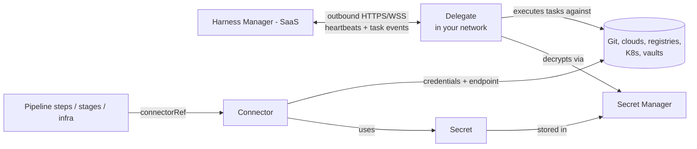

# Chapter 8. The connectivity layer

Harness is a SaaS control plane, but your clusters, registries, repos, and
vaults live behind your firewall. Four entities bridge that gap — and they
compose in one specific way:



A pipeline references a **Connector**; the connector's credentials are
**Secrets**; secrets live in a **Secret Manager**; and the component that
actually touches your systems — including decrypting those secrets — is the
**Delegate** running inside your network.

## 8.1 Delegate: the arm inside your network

"Harness Delegate is a service you run in your local network or VPC to
connect your artifacts, infrastructure, collaboration, verification, and
other providers with Harness Manager... The delegate performs all
operations, including deployment and integration"
(docs/platform/delegates/delegate-concepts/delegate-overview.md).

The connectivity model is the security story:

- **Outbound only.** The delegate connects out to Harness Manager over
  HTTPS/WSS; the WebSocket channel carries task-event notifications and
  heartbeats, "not... task data itself" (delegate-overview.md).
- **Install it behind your firewall**, in the same network as what it must
  reach; it needs access to your artifact servers, deployment targets, and
  cloud providers (same doc).
- **Heartbeats every minute** drive the Connected / Not Connected status on
  the delegate list (same doc).

Task assignment, when you don't pin delegates: heartbeat liveness → tag
matching → a **capability check** ("the delegate checks connectivity to your
external systems to determine whether it can carry out the task")
(delegate-overview.md). When you *do* pin via selectors — available on
steps, stages, pipelines, and connectors — Harness uses only those
delegates and never falls back (same doc). Delegates are scoped entities
like everything else: account, org, or project lists (same doc), sized
`LAPTOP → LARGE` (corpus/entity_schemas.md: DelegateSetupDetails), installed
via Kubernetes/Docker/Helm/Terraform artifacts
(`/ng/api/download-delegates/...`, `/ng/api/delegate-setup/generate-helm-values`
— corpus/path_tree.txt), and registered using **delegate tokens**
(docs/platform/delegates/secure-delegates/secure-delegates-with-tokens.md).

Where delegates are *not* involved: Harness Cloud build infrastructure runs
on Harness-managed VMs — delegate selectors are "not applicable" there
(docs/continuous-integration/use-ci/set-up-build-infrastructure/which-build-infrastructure-is-right-for-me.md).

## 8.2 Connector: typed credentials + endpoint

A Connector packages "where" and "as whom" for one external system — Git
providers, cloud platforms (AWS/GCP/Azure), K8s clusters, registries
(Docker/Nexus/Artifactory), ticketing and monitoring systems
(docs/platform/connectors/* subtree). It is YAML like everything else
(docs/platform/connectors/create-a-connector-using-yaml.md):

```yaml
connector:
  name: my-cluster
  identifier: my_cluster
  orgIdentifier: default
  projectIdentifier: default
  type: K8sCluster        # the connector type selects the spec shape
  spec:
    credential: ...
```

(yaml_examples/platform__pipelines__harness-yaml-quickstart.md.yaml, example 23)

Connectors are the single most-referenced entity in the domain: services
reference them for manifests and artifacts, infra definitions for clusters,
CI stages for images and caches, triggers for webhook registration, codebases
for cloning — always by `connectorRef`, always with scope prefixes
(`account.gcp`, `org.bitnami`; Chapter 1.1). "Connectors are used for all
third-party connections", and they execute through delegates
(delegate-overview.md). Both API generations expose CRUD plus an explicit
**test connection** verb (`/v1/.../connectors/{connector}/test-connection`,
`/ng/api/connectors/testConnection/{identifier}` — path_tree.txt).

## 8.3 Secret: the sensitive value

Secrets hold text, files, or SSH credentials, always encrypted at rest
(docs/platform/secrets/add-use-text-secrets.md;
docs/platform/secrets/secrets-management/harness-secret-manager-overview.md).
They're scoped (account/org/project) and consumed by expression:

```yaml
envVariables:
  SECRET: <+secrets.getValue("secretfile")>
```

(yaml_examples/platform__secrets__add-use-text-secrets.md.yaml)

Log output is scrubbed
(docs/platform/secrets/secrets-management/secrets-and-log-sanitization.md),
but the runtime-input caveat from Chapter 3.6 applies: anyone who can run a
pipeline can pass expressions through runtime inputs, so the docs recommend
OPA policies blocking `<+secrets.getValue` in runtime input
(docs/platform/variables-and-expressions/runtime-inputs.md).

## 8.4 Secret Manager: where secrets actually live

The Secret Manager is the storage backend. The default is built in: "Google
Cloud Key Management Service is the default Secret Manager in Harness and is
named Harness Secret Manager Google KMS"; alternatives are AWS KMS, HashiCorp
Vault, Azure Key Vault, GCP Secrets Manager, AWS Secrets Manager, and custom
managers
(docs/platform/secrets/secrets-management/harness-secret-manager-overview.md).

Two architectures, one distinction (same doc):

| | KMS-type (Google/AWS KMS) | Third-party vault (Vault, AKV, ASM, GCP SM) |
|---|---|---|
| Stores | Only the encryption key | Keys *and* secret values |
| Harness DB holds | Encrypted secret + encrypted data key (envelope encryption) | Only a reference |

And the load-bearing sentence for any security review: "Harness Manager does
not have access to your key management system, and only the Harness
Delegate, which sits in your private network, has access to it. Harness
never makes secret management accessible publicly." The delegate exchanges
keys with the secret manager and uses them without the keys ever leaving it
(same doc, "Harness Secret Management Process Overview").

Fine print worth knowing (same doc): any secret manager requires a running
delegate with direct access to it; KMS key rotation is unsupported (losing
old key versions loses secrets); secrets are cached encrypted for 30 minutes
(except Vault); Git Experience's "Connect Through Manager" mode has the
*Manager* decrypt Git-sync secrets, while "Connect Through Delegate" keeps
decryption in your network.

## 8.5 The composition, end to end

Trace one deploy step touching a private cluster:

1. Step needs `connectorRef: account.Harness_Kubernetes_Cluster`
   (environment-overview.md infra YAML).
2. The connector's credential fields reference Secrets.
3. Harness Manager creates a *task*; eligible delegates are filtered by
   selectors/tags, heartbeat, and capability check (delegate-overview.md).
4. The chosen delegate fetches the encrypted secret material, decrypts via
   the Secret Manager *from inside your network*, connects to the cluster,
   does the work, and streams results back (harness-secret-manager-overview.md;
   delegate-overview.md).

The SaaS control plane orchestrates; your data plane executes. Every
credential-touching operation happens on infrastructure you run.

> ### Mental model
>
> Think of the delegate as Harness's SSH-less bastion: an outbound-only
> worker you park next to your systems. Connectors are typed bookmarks —
> endpoint plus credentials — that pipelines cite by `connectorRef`; the
> credentials are secrets; the secrets live in a manager only the delegate
> can open. Nothing in the SaaS plane holds your keys, and nothing in your
> network accepts inbound connections: the delegate calls home, home never
> calls in.

### Check your understanding

1. A firewall auditor asks which inbound ports Harness needs into your VPC.
   Answer? *(§8.1: none — the delegate is outbound-only over HTTPS/WSS.)*
2. A step pinned to delegate selector `terraform` hangs `TaskWaiting`
   although other delegates are idle. Why? *(§8.1: pinned selectors never
   fall back; the tagged delegate is down or incapable.)*
3. Why does adding a Vault secret manager still require a delegate?
   *(§8.4: only the delegate talks to the secret manager; the SaaS plane
   never does.)*
4. Your account-level service can't use the perfectly good project-level
   Docker connector. Which two chapters explain why? *(Ch 1.1 scope
   visibility + §8.2/Ch 7.1: account-scope entities reference account-scope
   connectors only.)*
5. KMS-backed vs Vault-backed secret managers: where does the secret
   ciphertext live in each case? *(§8.4: KMS → in Harness's DB, envelope-
   encrypted; Vault → in Vault, Harness keeps a reference.)*
