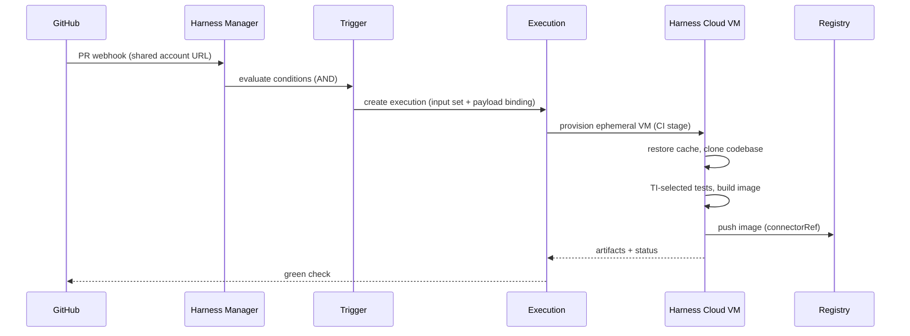
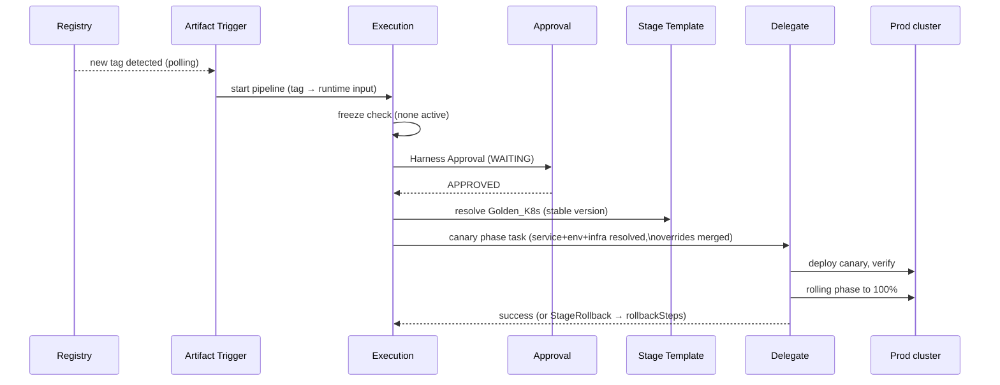

# Chapter 10. Life of a build, life of a deployment

This chapter is the book run in reverse: two end-to-end narratives that name
every entity as it enters the story. If you can follow both without looking
anything up, you have the mental model. (Entity names are **bold** on first
appearance; each claim's grounding lives in the chapter cited.)

## 10.1 Life of a build

*A developer opens a pull request touching `payments/`; minutes later the PR
shows a green check and a fresh image sits in the registry.*

**1. The event.** GitHub sends the PR event to the **Account**-wide webhook
endpoint — one shared URL per account, `?accountIdentifier=...` (Ch 4.2).
Harness fans the payload out to candidate **Triggers**.

**2. The match.** A Webhook-type **Trigger** owned by the `payments_ci`
**Pipeline** (in **Project** `payments`, **Organization** `engineering`)
declares event = PullRequest, target branch `main`, changed-files regex
`payments/.*`. All conditions AND together and all match (Ch 4.2). The
trigger was registered in the repo automatically through its code-repo
**Connector** (Ch 4.2, 8.2).

**3. The arguments.** The trigger binds the pipeline's runtime inputs: an
**Input Set** (or **Overlay Input Set** merging team defaults with service
specifics, last-writer-wins) supplies values; the PR's branch/commit flow in
through the **Codebase**'s `build: <+input>` and `<+trigger.payload...>`
expressions (Ch 3, 4.5).

**4. The execution.** An **Execution** is created — `planExecutionId`,
`runSequence`, `executionTriggerInfo` naming the trigger (Ch 5.1). The YAML
aggregate (Pipeline > **Stage** > **Step Group** > **Step**) compiles into an
execution plan; it may sit `Queued` behind concurrency limits before turning
`Running` (Ch 5.3–5.4).

**5. The machine.** The CI **Stage** requests **Build Infrastructure**:
`runtime: Cloud` — a fresh ephemeral Harness Cloud VM whose filesystem all
the stage's steps share; no **Delegate** involved on this path (Ch 6.1, 8.1).
(On the Kubernetes flavor, a Delegate would broker the pod in your cluster.)

**6. The code.** **Cache Intelligence** restores the dependency cache keyed
by build tool, then the stage clones the **Codebase** at the PR ref via the
Git **Connector** (Ch 6.5, 6.2).

**7. The work.** A Test step runs the suite — **Test Intelligence** asks the
TI service which tests the diff can affect and runs only those (Ch 6.4). A
Run step needing a token resolves `<+secrets.getValue("sonar_token")>`: the
**Secret**'s ciphertext is opened via the **Secret Manager** (Ch 8.3–8.4). A
Build-and-Push step builds the image and pushes it through the registry
**Connector** — an `account.`-scope reference, per the cross-scope prefix
rule (Ch 1.1, 6.3).

**8. The record.** The push lands the image tag in the registry; the
**Artifact** appears on the execution's Artifacts tab; caches are saved; the
VM terminates; the Execution ends `Success`, and the trigger's event history
links event → execution for the audit trail (Ch 6.6, 4.1).

## 10.2 Life of a deployment

*The 2 a.m. artifact trigger fires; by 2:20 the new payments version serves
100% of production traffic, with an approval and a canary in between.*

**1. The event.** An Artifact-type **Trigger** polls the Docker registry
through its **Connector** (delegate-run polling job, ~1-minute interval). A
genuinely new tag appears — floating tags like `latest` would never fire —
and the trigger starts the `payments_cd` **Pipeline** with the tag bound into
runtime input (Ch 4.4, 4.5).

**2. The gate check.** Before anything deploys, governance: is a
**Deployment Freeze** window active for this org/project/service/env? If
yes, the invocation is rejected (custom-webhook override permission aside).
Tonight: no freeze (Ch 7.7).

**3. The what.** The Deployment **Stage** resolves `serviceRef: payments` —
a **Service** at org scope whose Service Definition names Helm manifests
(via `org.` Git **Connector**) and the artifact source (via `account.`
registry Connector), with `tag` now filled by the trigger (Ch 7.1).

**4. The where.** `environmentRef: prod` resolves the **Environment**
(`type: Production`), and the stage picks **Infrastructure Definition**
`prod-k8s-1` — cluster connector + namespace + release name — one of several
infra definitions the environment owns (Ch 7.2).

**5. The adjustments.** **Service Overrides** for (prod × payments) merge in:
values-YAML keys merge with override priority; the HA database URL
**Variable** replaces the service's default wholesale (Ch 7.3). Environment
variables and account/org/project **Variables** are readable by expression
throughout (Ch 3.2).

**6. The human.** Stage 1 is a **Harness Approval** step: the Execution
parks `TimedWaiting`, an approval instance sits `WAITING` with a 1-day
timeout, and the release manager's user group approves — possibly typing
approver inputs later steps will read (Ch 5.8).

**7. The how.** The deploy stage — its body linked from an account-scope
stage **Template** (`templateRef: Golden_K8s`, stable version) — runs a
canary strategy: phase 1 deploys the canary fraction, verification gates
promotion, then the rolling phase replaces production instances (Ch 9,
7.5).

**8. The muscle.** Every cluster-touching task is executed by a **Delegate**
inside the VPC — selected by tags, heartbeat, and capability check — which
also decrypts the kubeconfig credentials via the **Secret Manager**;
nothing inbound ever crosses the firewall (Ch 8.1, 8.4).

**9. The safety net.** A `K8sRollingDeploy` timeout or failed verification
routes through the stage's failure strategy `StageRollback` into the
pre-declared `rollbackSteps` (`K8sRollingRollback`), restoring the prior
state. An operator could also mark-as-failed (clean, runs rollback) rather
than abort (fast, skips cleanup) (Ch 7.6, 5.5–5.6).

**10. The record.** The Execution finishes `Success`; the summary carries
trigger info, stage layout, and retry lineage; the environment's deployment
history and the approval's activity log hold the who-approved-what
(Ch 5.1, 5.8).

## 10.3 The whole domain on one page

Count the cast: Account, Organization, Project; Pipeline, Stage, Step, Step
Group; Trigger, Webhook, Input Set, Overlay Input Set; Execution, Approval;
Build Infrastructure, Codebase, CI steps, Test Intelligence, Cache
Intelligence, Artifact; Service, Environment, Infrastructure Definition,
Environment Group (the multi-env variant of step 4), Service Override,
Deployment Freeze; Connector, Secret, Secret Manager, Delegate, Template,
Variable. Thirty-one entities, two stories, no leftovers.

> ### Mental model (the book's, compressed)
>
> Harness is a scope tree holding YAML documents. One document type — the
> pipeline — is executable: it declares parameters, and triggers or humans
> call it with saved arguments. Each run compiles to a graph and walks a
> status machine, pausing for delegates, timers, queues, and people. CI
> stages are ephemeral machines that turn code into artifacts; CD stages are
> sentences — deploy Service to Environment's Infrastructure, strategy X,
> undo pre-declared. Everything that touches *your* world goes through
> connector → secret → secret manager → delegate, outbound-only. And
> structure itself is reusable: templates are versioned functions with a
> movable `stable` pointer.

### Check your understanding (capstone)

1. Walk the build story but on a self-managed Kubernetes build
   infrastructure. Which two entities enter the story that Harness Cloud
   kept out? *(Delegate and the cluster Connector — Ch 6.1, 8.1.)*
2. In the deployment story, list every point where scope prefixes appeared,
   and what breaks if the service were account-scoped instead of org-scoped.
   *(`org.` Git connector, `account.` registry connector; account-scope
   services may only fix account-scope connectors — Ch 7.1, 9.4.)*
3. The 2 a.m. deploy failed at the canary verification. Name the exact
   YAML paths that decided what happened next. *(stage.failureStrategies →
   onFailure.action.type: StageRollback → spec.execution.rollbackSteps —
   Ch 7.6.)*
4. Which entities did the *artifact trigger* need read/poll access to, and
   through what? *(The registry, through its Connector, executed by a
   Delegate's polling job — Ch 4.4, 8.1.)*
5. Why is "the pipeline is in Git" never a complete answer to "where does
   this pipeline live"? *(storeType REMOTE only outsources the YAML text;
   identity, triggers, input sets, and executions live in the Project —
   Ch 1.4.)*
