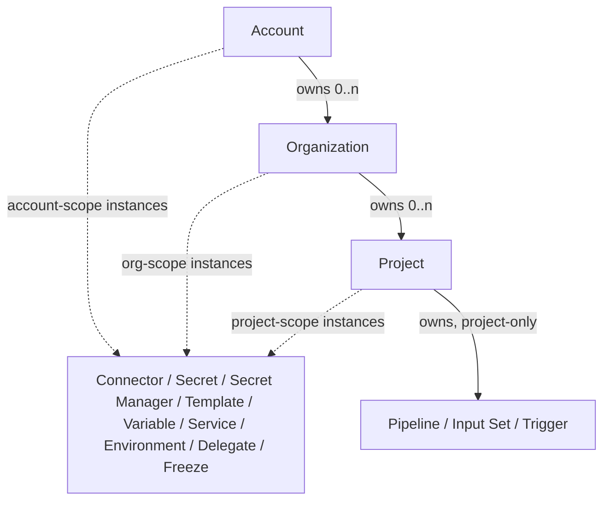
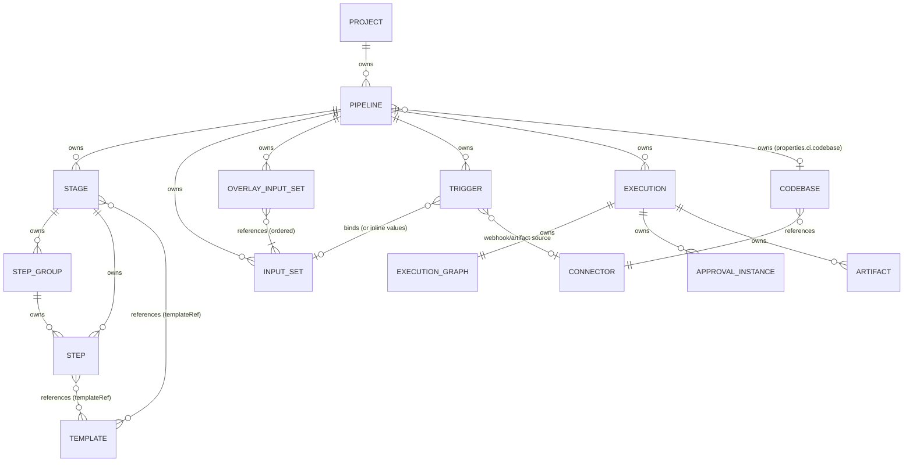
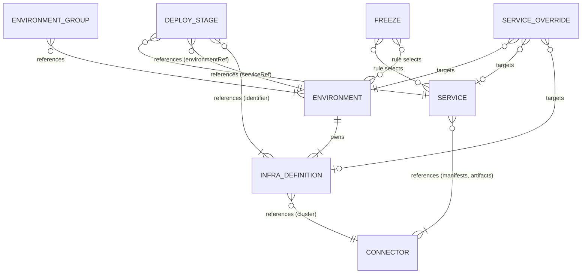
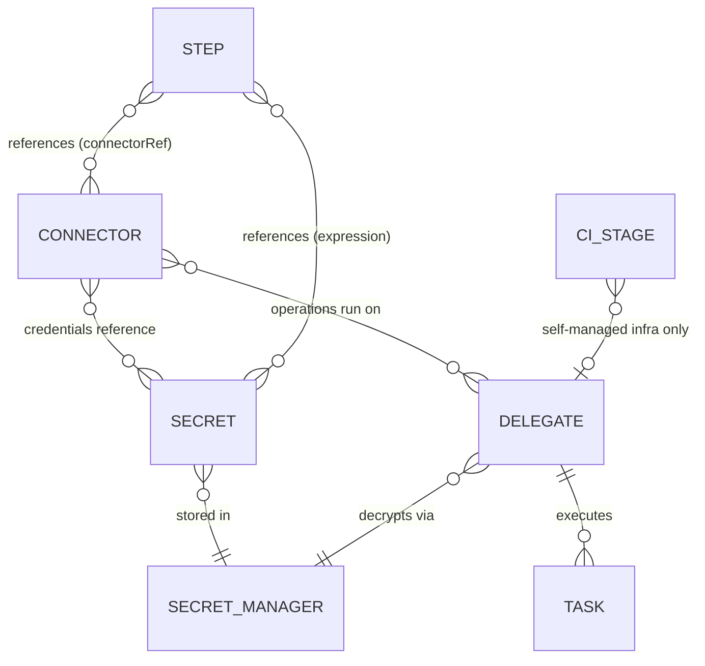

# Appendix B. Relationship diagrams

Two diagram sets — the scope hierarchy and the entity-relationship model —
followed by the evidence table backing every edge. Solid semantics:
*owns* = composition (child cannot outlive parent / is document-nested);
*references* = association by identifier (with scope prefixes where
applicable).

## B.1 Scope hierarchy

Reference direction is upward only: project → `org.X` → `account.X`
(Ch 1.1).

## B.2 The pipeline aggregate and its callers

## B.3 The CD triad and governance

## B.4 The connectivity layer

## B.5 Edge evidence table

| # | Edge | Kind | Evidence |
|---|---|---|---|
| 1 | Account owns Organization | owns | `/v1/orgs/{org}` subtree under account-authenticated API (path_tree.txt); `accountIdentifier` on all schemas (entity_schemas.md) |
| 2 | Organization owns Project | owns | `/v1/orgs/{org}/projects/{project}/...` nesting (path_tree.txt) |
| 3 | Project owns Pipeline | owns | `/v1/orgs/{org}/projects/{project}/pipelines` (path_tree.txt); `projectIdentifier` in pipeline YAML (docs/platform/pipelines/harness-yaml-quickstart.md) |
| 4 | Pipeline owns Stage | owns | `pipeline.stages[]` document nesting (harness-yaml-quickstart.md, "Basic pipeline structure"); no standalone stage CRUD (path_tree.txt) |
| 5 | Stage owns Step / Step Group; Step Group owns Step | owns | `stage.spec.execution.steps[]` nesting (harness-yaml-quickstart.md); stepGroup steps nesting (yaml_examples/continuous-delivery__cd-onboarding__new-user__cd-pipeline-modeling-overview.md.yaml) |
| 6 | Pipeline owns Input Set | owns | `InputSetResponse.pipelineIdentifier` (entity_schemas.md); input-set YAML nests `pipeline.identifier` (yaml_examples/platform__pipelines__harness-yaml-quickstart.md.yaml ex. 20) |
| 7 | Overlay references Input Sets (ordered) | references | `inputSetReferences` list (same file, ex. 22); "last input set to be resolved" wins (docs/platform/pipelines/input-sets.md) |
| 8 | Pipeline owns Trigger | owns | trigger YAML `pipelineIdentifier` (same file, ex. 18); `NGTriggerResponse.targetIdentifier` (entity_schemas.md) |
| 9 | Trigger binds Input Set (or inline values) | references | "you can use either an input set or provide runtime values directly, but not both" (docs/platform/triggers/triggering-pipelines.md) |
| 10 | Trigger references Connector | references | connector required for non-Custom Git triggers (triggering-pipelines.md); `connector_ref` on artifact trigger specs (entity_schemas.md: AcrArtifactTriggerSpec) |
| 11 | Pipeline owns Execution | owns | `/v1/.../pipelines/{pipeline}/executions/{execution}/artifacts` nesting (path_tree.txt); `pipelineIdentifier` on PipelineExecutionSummary (entity_schemas.md) |
| 12 | Execution owns graph / approval instances / artifacts | owns | ExecutionGraph nodeMap (entity_schemas.md); `/pipeline/api/approvals/{approvalInstanceId}/harness/activity` + `/v1/.../approvals/execution/{execution-id}` (path_tree.txt); executions/{execution}/artifacts (path_tree.txt) |
| 13 | Pipeline owns Codebase; Codebase references Connector | owns / references | `pipeline.properties.ci.codebase.connectorRef` (docs/continuous-integration/use-ci/codebase-configuration/create-and-configure-a-codebase.md) |
| 14 | Stage/Step references Template | references | `template.templateRef` + `templateInputs` in stage and step (yaml_examples/continuous-delivery__cd-onboarding__new-user__cd-pipeline-modeling-overview.md.yaml) |
| 15 | Environment owns Infrastructure Definition | owns | `/v1/environments/{environment}/infrastructures/{infrastructure-definition}` (path_tree.txt); `environmentRef` in infra YAML (docs/continuous-delivery/x-platform-cd-features/environments/environment-overview.md) |
| 16 | Environment Group references Environments | references | `envIdentifiers` incl. `org.`/`account.` prefixes (docs/continuous-delivery/x-platform-cd-features/environments/create-environment-groups.md) |
| 17 | Deploy stage references Service / Environment / Infra | references | `serviceRef`, `environmentRef`, `infrastructureDefinitions[].identifier` (yaml_examples/continuous-delivery__cd-onboarding__new-user__onboarding-path.md.yaml ex. 5) |
| 18 | Service Override targets Env × Service × Infra × Cluster | references | targeting fields + type enum ENV_/INFRA_/CLUSTER_..._OVERRIDE (entity_schemas.md: ServiceOverrideResponseV2) |
| 19 | Service references Connectors | references | `connectorRef: account.Harness_DockerHub`, `org.bitnami` in service YAML (docs/continuous-delivery/x-platform-cd-features/services/services-overview.md) |
| 20 | Infra Definition references Connector | references | `spec.connectorRef: account.Harness_Kubernetes_Cluster` (environment-overview.md) |
| 21 | Freeze rules select Org/Project/Service/EnvType | references | `entityConfigs.entities[].type: Org/Project/Service/EnvType` (yaml_examples/continuous-delivery__manage-deployments__deployment-freeze.md.yaml) |
| 22 | Connector references Secrets | references | credential fields in connector spec (docs/platform/connectors/create-a-connector-using-yaml.md); secret-manager process doc (docs/platform/secrets/secrets-management/harness-secret-manager-overview.md) |
| 23 | Secret stored in Secret Manager | references | KMS vs third-party storage architecture (harness-secret-manager-overview.md) |
| 24 | Connector operations run on Delegates | references | "Connectors are used for all third-party connections" under "Harness uses delegates for all operations" (docs/platform/delegates/delegate-concepts/delegate-overview.md) |
| 25 | Delegate decrypts via Secret Manager | references | "only the Harness Delegate... has access to it" (harness-secret-manager-overview.md) |
| 26 | Step references Connector / Secret | references | `spec.connectorRef` (yaml_examples/continuous-integration__use-ci__caching-ci-data__save-cache-in-gcs.md.yaml); `<+secrets.getValue(...)>` (yaml_examples/platform__secrets__add-use-text-secrets.md.yaml) |
| 27 | CI stage uses Delegate only on self-managed infra | references | delegate selectors "not applicable" on Harness Cloud (docs/continuous-integration/use-ci/set-up-build-infrastructure/which-build-infrastructure-is-right-for-me.md) |
| 28 | Shared-resource entities exist at all three scopes | scoping | services/environments/templates/variables/delegates/freezes docs cited per entity in Appendix A (§A.21, A.22, A.30, A.31, A.29, A.14) |

Cardinality notes: an Environment owns 1..n Infrastructure Definitions
("an environment can contain multiple infrastructure definitions",
environment-overview.md); a Pipeline owns 0..n of Input Sets, Triggers,
Executions (all optional); Overlay → Input Set is ordered 1..n
(input-sets.md). Cardinalities not directly stated in docs are **INFERRED**
from plural endpoints and YAML arrays.
