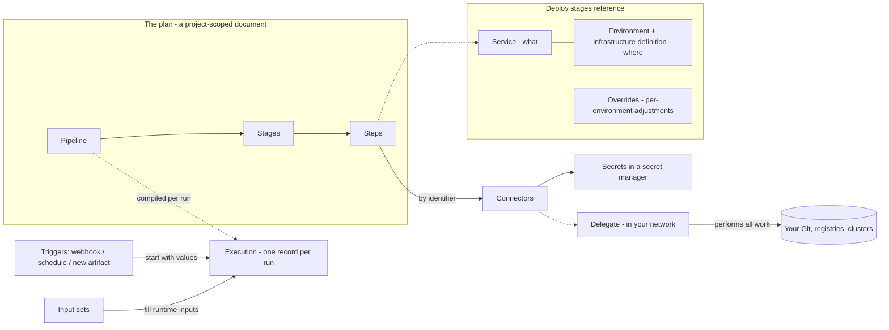

# How Harness pipelines work

This page builds the complete mental model of the pipeline system, one
concept at a time. Every term is introduced before it is used. If you read
nothing else in this guide, read this; every other page is a detailed
treatment of one paragraph here.

## Start from the problem

You have code in a Git repository, and you have running systems — clusters,
servers, cloud accounts. Between the two sits repetitive work: compile the
code, run the tests, package the result, put the new version on the systems,
and undo it if it misbehaves. You want that work to happen automatically,
the same way every time, with records of what happened.

Everything in Harness follows from automating that sentence.

## The plan: pipeline, stage, step

To automate work, you first write the work down. In Harness, that write-down
is called a **pipeline**: a plain text document, in YAML format, that
describes the work from start to finish. You can edit it as text or through
a visual editor — both views show the same document.

Work naturally divides into large phases — "build the code," "get a
sign-off," "deploy to production." Each phase is a **stage** in the
pipeline. A stage has a type, and the type says what kind of phase it is:
a **Build** stage compiles and tests, a **Deploy** stage puts software on
systems, an **Approval** stage waits for a person to say yes.

Inside a stage, the actual actions — run this script, build this image,
apply this manifest — are **steps**. Steps run in order, or in parallel
where you say so.

So the containment is strict and there are only three levels to remember:

> A pipeline contains stages. A stage contains steps. Nothing else contains
> anything.

One consequence worth noting immediately: the pipeline is a *plan*, not a
happening. Writing or editing a pipeline changes no running system.

## The happening: execution

When the plan runs, Harness creates an **execution**: a record of that one
run. The execution has its own identity, a copy of the values the run used,
a start and end time, and a live status — running, waiting, failed,
succeeded, aborted. Run the pipeline five times and you have one pipeline
and five executions.

Because the execution is a separate record, you can do things to a run
without touching the plan: watch its progress step by step, stop it, retry
it from the point where it failed, or run it again with the same values.

## Holes in the plan: runtime inputs and input sets

A plan with every value hard-coded can only do one thing. Usually some
values differ per run — which version to deploy, which branch to build.
For any such value, you write the placeholder `<+input>` in the pipeline
instead of a value. A placeholder written this way is called a **runtime
input**, and whoever starts the run supplies the value.

Typing the same values at every run gets old, so you can save a filled-in
set of values under a name. That saved set is an **input set**. At run
time you pick an input set instead of typing. You can also layer several
input sets on top of each other — an **overlay** — where later sets win on
any value defined twice.

A useful way to hold all of this: the pipeline is a function, runtime
inputs are its parameters, and input sets are saved argument lists.

## Starting runs without a person: triggers

Automation isn't complete while a human clicks Run. A **trigger** is a
standing rule attached to a pipeline: "when this event happens, start a run
with these values." Three kinds of event cover practically everything:

- Your Git provider reports a change — a push or a pull request. This is a
  **webhook trigger**, named after the webhook (the notification URL) your
  Git provider calls.
- A clock time arrives. This is a **scheduled trigger**, defined with a
  cron expression (the standard five-field schedule syntax).
- A new version of a built package appears in a **registry** — a storage
  service for build outputs, such as Docker Hub. This is an **artifact
  trigger**: *artifact* is the general word for a build output, such as a
  container image, and Harness checks the registry for new versions about
  once a minute.

A trigger supplies the pipeline's runtime inputs the same way a person
would — from an input set or from values in the event itself, such as the
branch name in a push.

## Reaching your systems: delegate, connector, secret

The steps in your plan must touch real systems: clone from your Git server,
push images to your registry, change what runs on your cluster. Harness runs
as a cloud service, and your systems are behind your firewall. Harness
never opens a connection into your network. Instead, you install a small
worker process, the **delegate**, inside your network. The delegate opens
one outgoing connection to Harness, asks "any work for me?", performs the
work against your systems from the inside, and reports back. Every action
that touches your infrastructure is carried out by a delegate.

The delegate needs to know where each external system is and how to log in.
That bundle — one system's address plus its credentials, saved under a
name — is a **connector**. You create a connector once per external system
(one for GitHub, one for Docker Hub, one per cluster), and steps refer to
it by name instead of repeating addresses and passwords.

Connectors must not contain passwords in plain text, so sensitive values
are stored separately as **secrets**. A secret is a named, encrypted value;
YAML refers to it by name and never contains the value itself. Secrets are
kept in a **secret manager** — the storage backend, either the built-in one
or your own vault — and, critically, only the delegate inside your network
can decrypt them. The Harness cloud service never holds your keys.

The chain is always the same, and it is the security model in one line:

> A step names a connector; the connector's credentials are secrets; the
> secrets live in a secret manager; and a delegate inside your network is
> the only thing that opens them and touches your systems.

## Building: what a Build stage adds

A Build stage runs your compile and test steps, and that raises two
questions the plan must answer.

*Where do the steps run?* On a machine you choose per stage, called the
stage's **build infrastructure**. Harness can supply the machine — a fresh,
short-lived virtual machine that exists just for the stage, an option
called **Harness Cloud** — or you can supply it: your Kubernetes cluster
(each stage becomes a pod, reached through a connector and a delegate),
your cloud virtual machines, or a single machine you run yourself. All
steps in a stage share that one machine's filesystem, which is how one
step's output becomes the next step's input.

*Which code do they run against?* The pipeline names its Git repository
once — the repository connector plus the repository name. This
configuration is the pipeline's **codebase**, and every Build stage clones
it before running steps, at whatever branch or commit the run's inputs or
triggering event chose.

The stage's steps then do the work: run scripts, run tests, build and push
an image. The artifacts a run produces are listed on the execution's record.
Two optional accelerators reduce repeated effort: **Test Intelligence**
runs only the tests affected by the change instead of the whole suite, and
**Cache Intelligence** saves dependency downloads between runs.

## Deploying: what a Deploy stage adds

To deploy, the plan must answer *what*, *where*, and *how*.

**What** you deploy is a **service**: a named definition of one deployable
thing — where its manifests live (the files that describe its desired
deployed shape, such as Kubernetes manifests or a Helm chart, reached
through a connector) and which artifact is its executable content, with the
version usually left as a runtime input. You define a service once and every pipeline that deploys it refers
to it by name.

**Where** you deploy is an **environment** — a named target such as `dev`
or `prod`, marked as production or non-production. An environment is
logical; the physical details live in its **infrastructure definitions**,
each naming one concrete target such as "this cluster, this namespace,"
through a cluster connector. One environment can hold several
infrastructure definitions; a Deploy stage picks the environment and one
definition inside it.

One service, many environments — but the settings differ per environment.
Rather than copying the service, you attach **service overrides**: named
adjustments that apply when a given service deploys into a given
environment, replacing variables or layering configuration values.

**How** the new version replaces the old is the stage's strategy, chosen
from three standard patterns: **rolling** (replace instances a few at a
time), **blue-green** (stand up the new version beside the old, then switch
traffic), and **canary** (send a small share of traffic to the new version,
verify, then expand). Whatever the strategy, the stage also carries
**rollback steps** — the pre-written undo — and a failure routes into them
automatically, restoring what was there before.

Two controls sit above individual stages. An **approval** step or stage
pauses the run until named people (or a ticket system) say yes — put one
before production. A **freeze window** is a scheduled ban on deployments —
"no production changes over the holidays" — that stops deploy stages and
rejects triggers for its duration while leaving builds untouched.

## Sharing and scale: scopes, names, templates

Teams share things: one GitHub connector should serve every project, one
`prod` environment definition should serve every pipeline that deploys to
production. Harness organizes everything into three nested levels called
**scopes**: the **account** (your company — the root), **organizations**
inside it (a business unit), and **projects** inside those (a team's
working space). Anything created at a higher scope is usable by everything
below it. Pipelines themselves always live in a project; shared resources —
connectors, secrets, services, environments, delegates — can live at any
of the three levels.

Every resource has two labels: a **name** you can change freely, for
humans, and an **identifier** that never changes, for references. All the
by-name references above — `serviceRef`, `connectorRef`, a trigger's
pipeline — actually use identifiers, which is why renaming things breaks
nothing. Identifiers are unique within their scope, and a reference to a
higher scope says so with a prefix: `account.docker_hub` names the
account-level connector, `org.bitnami` the organization-level one.

Finally, whole chunks of plan can be shared, not just values and resources.
A **template** is a step, stage, or entire pipeline published as a
versioned, reusable unit at some scope. Pipelines link to it by identifier
and version and supply only its declared inputs, so a platform team can fix
or improve one template and every linked pipeline follows.

## The model in one picture

## Rules you can reason with

Four invariants carry almost every question you'll face:

1. **The pipeline is a plan; the execution is a record of one run.**
   Editing the plan never changes a running system; only executions do
   things, and every happening leaves an execution to inspect.
2. **Anything that varies has one designated home.** Varies per run → a
   runtime input, filled by a person, an input set, or a trigger. Varies
   per environment → a service override. Shared across pipelines or teams →
   a resource at the right scope, referenced by identifier.
3. **Harness never reaches into your network; your delegate reaches out.**
   Every touch on your systems goes step → connector → secret → delegate,
   and decryption happens only on the delegate.
4. **Undo is declared in advance.** Rollback steps, failure strategies,
   approvals, and freeze windows are all part of the plan — safety is
   written down, not improvised during an incident.

When something puzzles you, find which rule it falls under, then open the
section of this guide that covers it: the plan's anatomy in
[Pipeline structure](pipeline-structure.md), holes and values in
[Configuring pipeline inputs](../inputs/README.md), events in
[Starting pipelines with triggers](../triggers/README.md), runs in
[Managing executions](../executions/README.md), building in
[CI stages](../ci/README.md), deploying in [CD stages](../cd/README.md),
reach and credentials in
[Connecting to your infrastructure](../connect/README.md), and sharing in
[Scopes](scopes.md) and [Templates](../reuse/templates.md).

---
**Sources:** This page synthesizes the pages it links to; each claim is
sourced on the page that treats it. Core grounding:
docs/platform/pipelines/harness-yaml-quickstart.md (pipeline/stage/step
YAML); docs/platform/pipelines/add-a-stage.md (stage types);
docs/platform/variables-and-expressions/runtime-inputs.md and
docs/platform/pipelines/input-sets.md (runtime inputs, input sets,
overlays); docs/platform/triggers/triggering-pipelines.md and
docs/platform/triggers/trigger-on-a-new-artifact.md (trigger kinds);
corpus/entity_schemas.md (PipelineExecutionSummary — execution record and
statuses); docs/platform/delegates/delegate-concepts/delegate-overview.md
(delegate model);
docs/platform/secrets/secrets-management/harness-secret-manager-overview.md
(secret managers, delegate-only decryption);
docs/continuous-integration/use-ci/set-up-build-infrastructure/which-build-infrastructure-is-right-for-me.md
and use-harness-cloud-build-infrastructure.md (build infrastructure);
docs/continuous-integration/use-ci/codebase-configuration/create-and-configure-a-codebase.md
(codebase); docs/continuous-delivery/x-platform-cd-features/services/services-overview.md,
environments/environment-overview.md, environments/service-overrides.md
(service/environment/override);
docs/continuous-delivery/manage-deployments/deployment-concepts.md
(strategies); docs/continuous-delivery/manage-deployments/deployment-freeze.md
(freeze); docs/platform/templates/template.md (templates);
docs/continuous-delivery/x-platform-cd-features/environments/create-environment-groups.md
(scope prefixes).
