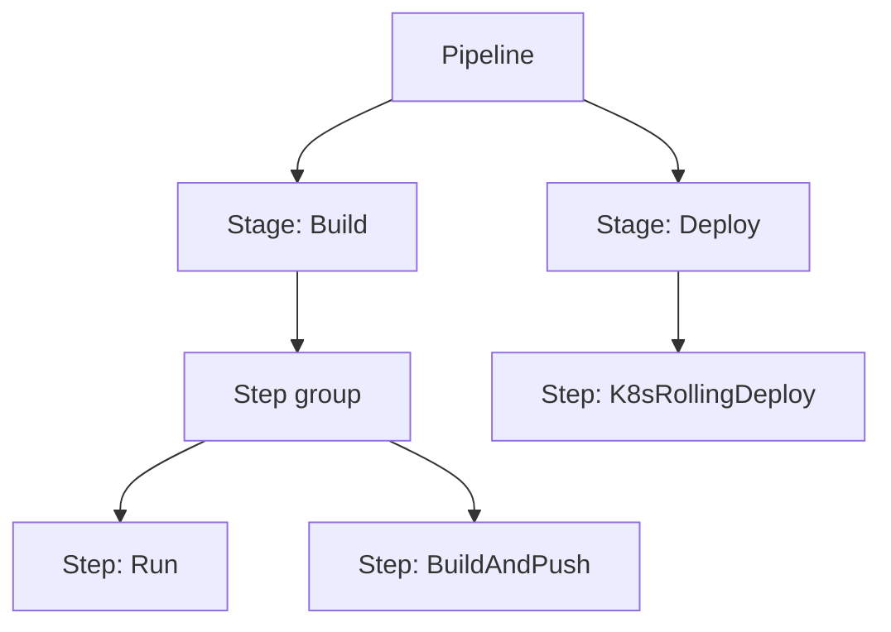

# Pipeline structure: stages and steps

A pipeline is a single YAML document with a strict containment hierarchy:
the pipeline owns its stages, each stage owns its steps, and steps can be
grouped into step groups. Nothing inside a pipeline exists independently —
there are no standalone create, read, update, or delete APIs for stages or
steps. To reuse a stage or step across pipelines, use a template. For more
information, see [Reusing configuration with templates](../reuse/templates.md).



## Pipeline

The pipeline document's root carries identity, pipeline-wide settings, and
the list of stages:

```yaml
pipeline:
  name: YAML Example
  identifier: YAML_Example
  projectIdentifier: default   # pipelines are always project-scoped
  orgIdentifier: default
  tags: {}
  stages:
    - stage: ...
  properties:                  # pipeline-wide, e.g. the CI codebase
  variables: []
  notificationRules:
  timeout:
```

## Stages

A stage performs one major segment of the workflow, such as building,
approving, or deploying. The stage type determines its settings and which
steps it can contain:

| Stage type | Purpose |
|---|---|
| Build (`type: CI`) | Build, test, and push artifacts |
| Deploy (`type: Deployment`) | Deploy a service to an environment |
| Approval | Pause for a human or ticket-system decision |
| Custom | Any other work; no predefined requirements |
| Pipeline | Run another pipeline as a chained stage |
| Feature Flag, Security Tests | Stage types from adjacent modules |
| Dynamic | Stage whose YAML is supplied at runtime |

Each stage also supports conditional execution (`when`), failure strategies,
looping strategies (matrix, repeat, parallelism), and stage variables.

Stage variables are available across the pipeline. Reference them within the
stage as `<+stage.variables.NAME>`, and from other stages as
`<+pipeline.stages.STAGE_ID.variables.NAME>`. This is the built-in way to
pass values between stages.

## Steps and step groups

Steps are the atomic actions. The available step types depend on the stage
type — a Build stage offers Run, Build and Push, Background, Plugin, and
Test steps; a Deploy stage offers deployment, script, and approval steps.

```yaml
- step:
    type: Run
    name: Run_1
    identifier: Run_1
    spec:
      shell: Sh
      command: |
        echo $SECRET | base64 --decode > decoded.txt
      envVariables:
        SECRET: <+secrets.getValue("secretfile")>
```

Step groups bundle steps that share settings, such as shared paths or, in CD
stages, a shared container environment. Steps, step groups, and whole stages
can run in parallel.

---
**Sources:** docs/platform/pipelines/harness-yaml-quickstart.md (pipeline and
stage YAML outlines); docs/platform/pipelines/add-a-stage.md (stage types,
stage variables, advanced settings);
docs/continuous-delivery/x-platform-cd-features/cd-steps/containerized-steps/containerized-step-groups.md;
yaml_examples/platform__secrets__add-use-text-secrets.md.yaml (step example);
corpus/path_tree.txt (no standalone stage/step CRUD).
