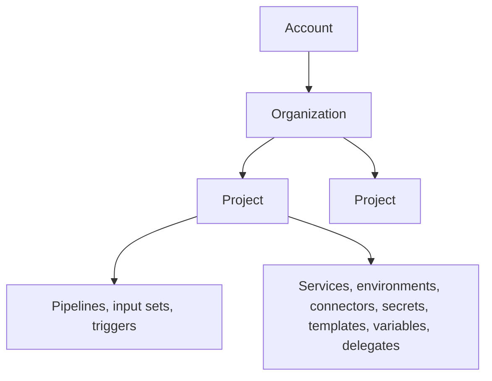

# Scopes: account, organization, and project

Harness arranges all resources in a three-level hierarchy. The account is
the root; organizations group related work, typically by business unit; and
projects are where teams do day-to-day work. Every resource belongs to
exactly one scope.



Most shared resources — services, environments, connectors, secrets,
templates, variables, delegates, and freeze windows — can be created at any
of the three scopes. A resource created at a higher scope is available to
all scopes below it. For example, an account-level connector can be used by
every project in the account.

Pipelines, input sets, and triggers are the exception: they exist only at
project scope. Neither API generation has account-level or organization-level
pipeline endpoints. (INFERRED from the API path inventory.)

## Referencing resources across scopes

When a resource references another resource at a higher scope, the reference
carries a prefix: `org.` for organization scope and `account.` for account
scope. Project-scope references have no prefix.

```yaml
envIdentifiers:
  - test                              # project scope
  - org.testE                         # organization scope
  - account.CDCNGAuto_EnvNg59wFkWCjQQ # account scope
```

The same syntax applies everywhere references appear, such as
`connectorRef: account.Harness_DockerHub` in a service definition or
`connectorRef: org.bitnami` for an organization-level Helm repository.
Variables use their own expression forms: `<+variable.account.NAME>` and
`<+variable.org.NAME>`.

References work upward only. A project resource can reference organization
and account resources, but an account resource cannot reference downward.
For example, an account-level service can only use account-level connectors.

## Why prefixes are required

Identifiers are unique within a scope, not globally. A connector named
`docker_hub` can exist at project scope and again at account scope as two
different resources. The prefix tells Harness which one you mean.

For more information about identifier rules, see
[Identifiers and names](identifiers.md).

---
**Sources:** docs/continuous-delivery/x-platform-cd-features/environments/create-environment-groups.md
(prefix rules and example); docs/continuous-delivery/x-platform-cd-features/services/services-overview.md
(account/org scoping, connector scope restriction);
docs/platform/variables-and-expressions/add-a-variable.md (scope visibility,
variable expressions); corpus/path_tree.txt (`/v1/orgs/{org}/projects/{project}/...`
nesting; absence of non-project pipeline endpoints).
