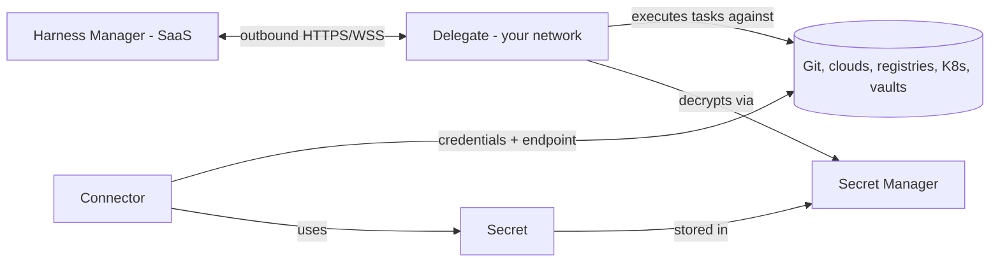

# Connecting to your infrastructure

Harness is a SaaS control plane; your clusters, repositories, registries,
and vaults live in your network. Four entities bridge the gap, and they
compose in one specific way: a pipeline references a connector; the
connector's credentials are secrets; secrets live in a secret manager; and
the component that actually touches your systems — including decrypting
those secrets — is the delegate running inside your network.

Nothing in your network accepts inbound connections from Harness: the
delegate calls out, and the SaaS plane never calls in. Every
credential-touching operation happens on infrastructure you run.

## Topics

- [Delegates](delegates.md)
- [Connectors](connectors.md)
- [Secrets and secret managers](secrets.md)
