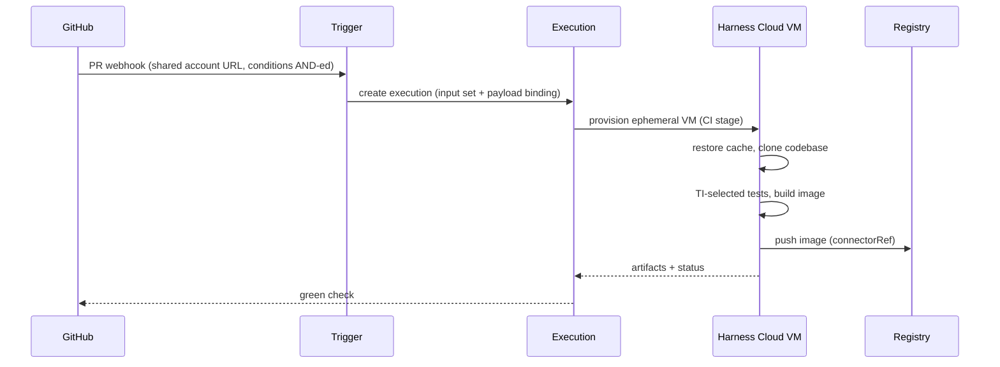

# Life of a build

A developer opens a pull request that touches `payments/`. Minutes later the
PR shows a green check and a fresh image is in the registry. This is what
happened in between.

1. **GitHub delivers the event.** The PR event arrives at the account's
   shared webhook URL. Harness evaluates it against the account's webhook
   triggers.

2. **A trigger matches.** A webhook trigger on the `payments_ci` pipeline
   requires event PullRequest, target branch `main`, and changed files
   matching `payments/.*`. All conditions match. The trigger was registered
   in the repository automatically through its code-repo connector.

3. **Inputs are bound.** The trigger supplies the pipeline's runtime inputs
   from an input set (or an overlay of input sets, where the last set wins
   on conflicts). The PR's branch and commit flow in through the codebase's
   `build: <+input>` and `<+trigger.payload...>` expressions.

4. **An execution is created.** It gets a `planExecutionId` and a run
   number; `executionTriggerInfo` records the trigger as the initiator. The
   pipeline YAML compiles into an execution plan. The run may sit `Queued`
   behind concurrency limits before it turns `Running`.

5. **The CI stage gets a machine.** With `runtime: Cloud`, the stage runs on
   a fresh, ephemeral Harness Cloud VM whose filesystem all steps share. No
   delegate is involved on this path. (On a Kubernetes build infrastructure,
   a delegate would broker a pod in your cluster instead.)

6. **Cache and code arrive.** Cache Intelligence restores the dependency
   cache for the detected build tool, then the stage clones the codebase at
   the PR ref through the Git connector.

7. **Steps do the work.** The Test step asks Test Intelligence for the
   tests relevant to the diff and runs only those. A Run step resolves
   `<+secrets.getValue("sonar_token")>` through the secret manager. A Build
   and Push step builds the image and pushes it through the registry
   connector — an `account.`-scope reference.

8. **The build leaves a record.** The image tag lands in the registry; the
   artifact appears on the execution's Artifacts tab; caches are saved; the
   VM terminates. The execution ends successfully, and the trigger's event
   history links event to execution.

Entities used: account, organization, project, pipeline, stage, step,
trigger, webhook, input set, overlay input set, execution, build
infrastructure, codebase, CI steps, Test Intelligence, Cache Intelligence,
artifact, connector, secret, secret manager.

For the concepts behind each step, see
[Webhook triggers](../triggers/webhook-triggers.md),
[Input sets and overlays](../inputs/input-sets.md),
[Managing executions](../executions/README.md), and
[Building with CI stages](../ci/README.md).
