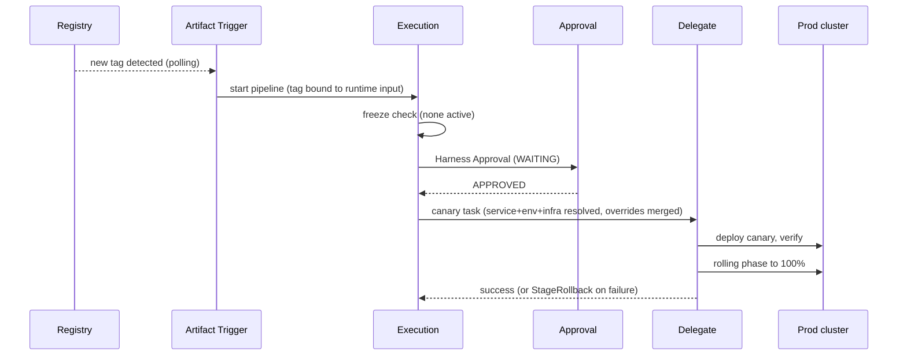

# Life of a deployment

At 2:00 a.m. a new image tag reaches the registry. By 2:20 the new payments
version serves all production traffic, with an approval and a canary in
between. This is what happened.

1. **The artifact trigger fires.** A delegate-run polling job watches the
   registry through its connector (about once per minute). A genuinely new
   tag appears — a floating tag like `latest` would never fire — and the
   trigger starts the `payments_cd` pipeline with the tag bound into a
   runtime input.

2. **Governance is checked.** If a deployment freeze window covered this
   org, project, service, or environment, the invocation would be rejected.
   Tonight there is no freeze.

3. **The service resolves.** The Deployment stage's `serviceRef: payments`
   points to an org-scope service whose definition names Helm manifests
   (via an `org.` Git connector) and the artifact source (via an `account.`
   registry connector). The trigger's tag fills the artifact version.

4. **The environment resolves.** `environmentRef: prod` selects the
   Production environment, and the stage picks infrastructure definition
   `prod-k8s-1` — cluster connector, namespace, and release name — one of
   several the environment owns.

5. **Overrides apply.** The service overrides for prod × payments merge in:
   values-YAML keys merge with override priority; the HA database URL
   variable replaces the service's default wholesale.

6. **A human approves.** The first stage is a Harness Approval step. The
   execution parks; the approval instance waits with a one-day timeout; the
   release manager's user group approves, optionally entering approver
   inputs that later steps read.

7. **The canary runs.** The deploy stage — its body linked from an
   account-scope stage template at its stable version — deploys the canary
   fraction, verification gates promotion, and the rolling phase replaces
   production instances.

8. **A delegate does the work.** Every cluster-touching task executes on a
   delegate inside the VPC, selected by tags, heartbeat, and a capability
   check. The delegate decrypts the cluster credentials through the secret
   manager; nothing inbound crosses the firewall.

9. **The safety net waits.** A failed step would route through the stage's
   `StageRollback` failure strategy into the pre-declared `rollbackSteps`,
   restoring the previous state. An operator could also mark the stage as
   failed (clean: rollback runs) rather than abort (fast: cleanup skipped).

10. **The run leaves a record.** The execution ends successfully; the
    summary carries the trigger info and stage layout, and the approval's
    activity log records who approved.

Entities used: service, environment, infrastructure definition, service
override, environment group (in multi-environment variants), deployment
freeze, trigger, execution, approval, template, delegate, connector, secret,
secret manager, variable.

For the concepts behind each step, see
[Artifact and manifest triggers](../triggers/artifact-triggers.md),
[Deploying with CD stages](../cd/README.md),
[Approvals](../executions/approvals.md), and
[Connecting to your infrastructure](../connect/README.md).
